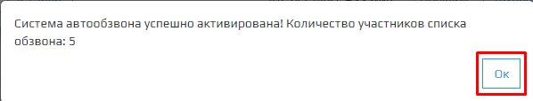

Перед запуском АД проверьте наличие лицевых счетов с номерами телефонов в поле **Телефон**, начиная с 8 в формате 89000000000 ( Без знаков + , () . - ).  
Если лицевых счетов нет, загрузите свою базу данных. Узнать, как это сделать, можно по этой [ссылке](https://optimistic-hawking-7d4cd0.netlify.app/ver.1.7.0/4-instructions/how_to_upload_database "Загрузка своей базы данных").

1. Для того, чтобы включить настройки **АД**, зайдите в личный кабинет и нажмите на вкладку.  
   

2. Из выпадающего списка выберите **Автообзвон должников**.  
   

3. Откроется модальное окно **Настройки автообзвона**, далее после выбора необходимых вам параметров модуля АД нажмите на кнопку **Активировать**.  

4. После активации **АД** откроется модальное окно об успешной активации системы автообзвона и количеством участников автообзвона.
5. Нажмите на кнопку **ОК** для подтверждения активации **АД**.

🛈 Если в таблице у лицевого счета поле **phone** пустое, этот лицевой счет не будет включен в очередь на автообзвон.  
🛈 Если в таблице у всех лицевых счетов поле phone пустое, АД не активируется и появится модальное окно с ошибкой.

Пример базы данных лицевых счетов без телефонов.

")