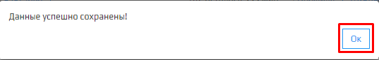

1. Зайдите в **Личный кабинет** площадки Kloud.One и нажмите на вкладку **Настройки**.

  

2. **Настройки** и выберите вкладку **Приём показаний**.

3. Нажмите на параметр, который вы хотите изменить, и исправьте значение на нужное.  
Например **Голос автоответчика**  меняем  с **oksana** на **zahar**. После чего нажимаем кнопку **Сохранить**. 

 

4. Новые параметры сохранятся, и появится модальное окно, оповещающее о том, что данные успешно сохранены. Для продолжения нажмите **Ок**.

 
 
5. По такому же принципу сохраняются изменения и у других полей модуля **Приема показаний**.