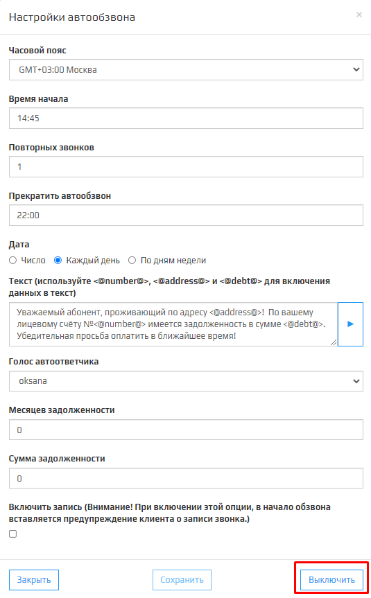
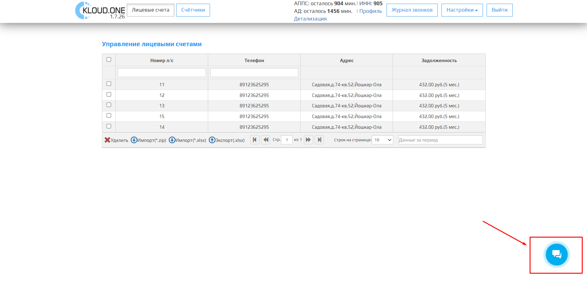

Проблема с запуском **Автообзвона должников** решается соблюдением следующих проверок:  
1. Проверьте в Личном кабинете запущен ли модуль **Автообзвон должников**.

2. Проверьте в Личном кабинете баланс модуля **Автообзвон должников**.

3. Проверьте правильность выбранных вами параметров - **Часовой пояс**, **Время начала**, **Прекратить автообзвон**, **Дата**, **Месяцев задолженности** и **Сумма задолженности**.

4. Проверьте правильность введенных данных в настройках SIP аккаунта.

5. Проверьте баланс SIP-подключения номера телефона.  
Если после прохождения вышеперечисленных проверок, вам не удалось запустить **Автообзвон должников**, нажмите на кнопку  в правом нижнем углу и напишите обращение в техподдержку.

