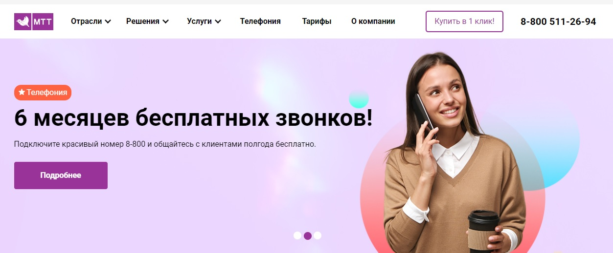

### Поддерживаемые Браузеры

Google Chrome 85.0 или новее

### Список сторонних компонентов

1. Провайдер SIP-телефонии.

**Мультифон** - Мультифон Бизнес, услуга от Мегафона, которая позволяет организовать телефонную связь через интернет, используя протокол передачи данных - SIP.  
Подробнее вы можете прочитать по ссылке  (https://multifon.megafon.ru/).

Мы используем Мультифон, как номер телефона, который используется модулями ОД и ППС для исходящих или входящих звонков.  

**Виртуальная АТС от Мегафон** - виртуальная АТС, которая использует протокол передачи данных - SIP. Мы в свою очередь используем его как номер телефона, с которого происходят исходящие или  входящие звонки для модулей  ППС и ОД.  
Подробнее вы можете прочитать по ссылке  (https://vats.megafon.ru/)

**Mango Office** - виртуальная АТС Mango Office, которая использует протокол передачи данных - SIP.  
Подробнее вы можете прочитать по ссылке  (https://www.mango-office.ru/).

**Виртуальная АТС от Ростелеком** - виртуальная АТС, которая использует протокол передачи данных - SIP. Мы, в свою очередь, используем его как номер телефона, с которого происходят исходящие или  входящие звонки для модулей  ППС и ОД.  
Подробнее вы можете прочитать по ссылке (https://maryel.rt.ru/b2b/telephony/vats).

**Виртуальная АТС от Дом.Ру** - виртуальная АТС, которая использует протокол передачи данных - SIP. Мы, в свою очередь, используем его как номер телефона, с которого происходят исходящие или входящие звонки для модулей ППС и ОД.

**Mtt.ru** - виртуальная АТС от MTT помогает масштабировать ваш бизнес и увеличивать продажи без дополнительных затрат на оборудование и настройку. Подключайте к виртуальной АТС необходимое количество абонентов — неважно, где они находятся, и какими устройствами пользуются (компьютер, ноутбук, планшет, смартфон и т.д.).
Подробнее вы можете прочитать по ссылке (https://www.mtt.ru/services_new/vats/)

1. ERP-система.

**1C ЖКХ Рарус** - модуль к 1С Учет, который представляет из себя программу, созданную 1С ЖКХ Рарус для автоматизации предприятий сферы ЖКХ. Служит, как интерфейс для загрузки данных: лицевых счетов, счетчиков и показаний по этим счетчикам.  
Подробнее вы можете прочитать по ссылке (https://vgkh.ru/jsk/jkh/)

**Scloud.ru** - сертифицированный оператор по аренде программ 1С, предлагающий облачные решения. Является альтернативным способ использование 1С без установки программы на ваш компьютер.  
Подробнее вы можете прочитать по ссылке https://scloud.ru/

3. CRM-система

**Bitrix24** - CRM  от 1С-Битрикс, используется для автоматического оповещения клиентов о низком балансе в приложениях ППС и ОД. Клиент получает письмо, в котором содержится название приложения, его текущий баланс, и просьбу о его пополнении.

