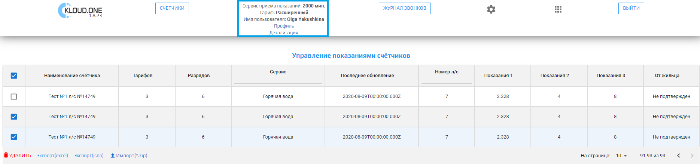

#### Инфопанель

Раздел представляет собой панель, в которой отображаются: текущий остаток баланса приложения **ППС**, а также наименование тарифа и имя пользователя. Помимо этого, в инфопанели можно перейти к разделам **Профиль** и **Детализация**.

