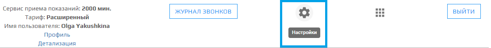

При нажатии на иконку **Настройки** открывается модальное окно, в котором находятся настройки фраз сценария и параметры сценария модуля ППС.

В модуле настройки **Приема показаний** пользователь может:    
- включить интеграцию с 1С: Учет в управляющих компаниях ЖКХ;
- выбрать часовой пояс для правильного начала приема показаний;   
- изменить просьбу автоответчика о вводе лицевого счета;  
- изменить просьбу автоответчика о вводе показаний счетчика;  
- изменить ответ автоответчика на возникшие проблемы с дачей показаний;  
- изменить сообщение прощания автоответчика с абонентом;  
- выбрать голос автоответчика;  
- включить/отключить привязку лицевых счетов к номеру телефона;  
- настроить дату приема показаний (принимать всегда, принимать показания по расписанию);  
- включить/выключить запись звонка для возможности прослушать её в "Журнале звонков";  
- возможность сбросить все настройки **Приема показаний** до первоначальных.  

