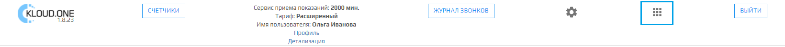
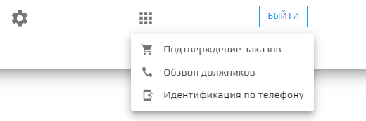

## Переход к приложениям платформы Kloud.One в Личном кабинете

### Иконка Переход к приложениям платформы Kloud.One в Личном кабинете

Иконка для перехода в другие приложения платформы Kloud.One (**Подтверждение заказов**, **Обзвон должников**, **Идентификация по телефону**) расположена в правой верхней части личного кабинета.

Иконка при нажатии на нее представляет собой выпадающий список модулей платформы Kloud.One.

При выборе одного из модулей открывается личный кабинет выбранного приложения.