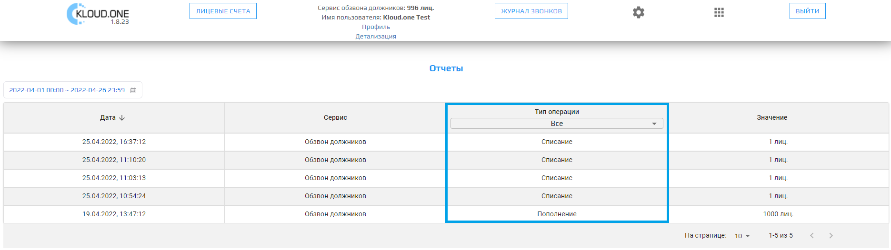
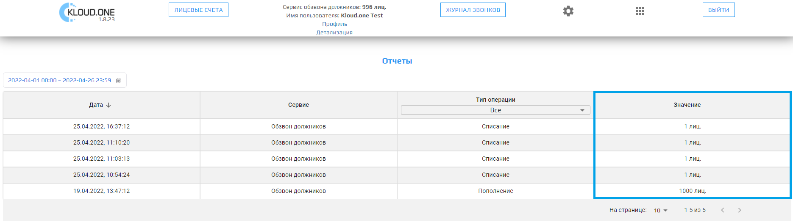

 Раздел **Детализация** представляет собой **Отчеты**. Этот раздел содержит таблицу со следующими данными:  
1. Дата;  
2. Сервис;  
3. Тип операции;  
4. Значение.  

В разделе **Детализация** пользователь может:  
- выбрать период, за который ему будет предоставлен отчёт о расходах лицензий;  
- ознакомиться с типом операции (пополнение или списание);
- ознакомиться с количеством добавленных и использованных лицензий.

#### Выбор даты

Над таблицей в левой части расположен виджет выбора даты. Для выбора необходимого периода для просмотра отчета необходимо кликнуть на поле с датами и иконкой календаря. Открывается календарь, включающий в себя текущий и следующий месяцы. В календаре выбираются первая и последняя даты отчетного периода, либо нажимаются кнопки **Сегодня**, **Вчера**, **Последние 7 дней**, расположенные внизу виджета. Для подтверждения верности выбранного периода и просмотра отчета необходимо нажать кнопку **ОК**.

#### Дата

В левом столбе таблицы расположен столбец **Дата**. В этом столбце при выборе временного отрезка в виджете даты формируется отчет с датой и временем совершенной операции в формате: 
DD-MM-YYYY, HH:mm:ss, где:

DD-MM-YYYY – дата в формате день-месяц-год.
HH:mm:ss – время: часы-минуты-секунды.

#### Сервис

В отчетах платформы Kloud.One раздел таблицы **Сервис** демонстрирует, по какой из услуг представлена отчетность в данной таблице.

#### Тип операции

В данном разделе таблицы можно увидеть, какой тип операции был исполнен. Всего представлено два типа операции: **Пополнение** и **Списание**. В верхней строке таблицы представлен сортировочный фильтр. Можно выбрать один из типов операций, тогда в таблице будут отображены испключительно транзакции этого типа.

#### Значение

Последний раздел таблицы **Значение** демонстрирует изменения баланса - пополнения и списания. 

