## Таблица Журнал звонков содержит:

Вкладка **Журнал Звонков** представляет собой таблицу **Журнала Звонков**, в которой отображаются данные о звонках: 
- Дата, 
- Телефон,
- Данные, 
- Статус, 
- Длительность,
- Файл, 
- Результат, 
- Общая длительность звонков, 
- кнопка Экспорт звонков
- Панель навигации по таблице
- виджет Данные за период.

### Дата

В поле указывается дата и время звонка в формате **ДД.ММ.ГГГГ**, **ЧЧ.ММ.СС**. При нажатии на надпись **Дата** включается сортировка.

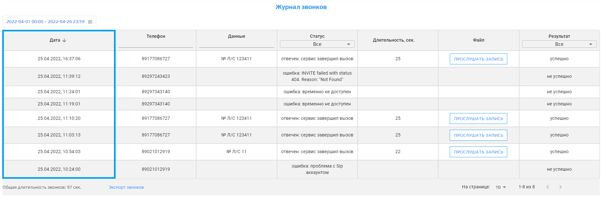

### Телефон

В поле указывается номер телефона, на который звонили.  
Для сценария **Обзвон должников** номер записывается в формате **7xxxxxxxxxx**.  
🛈 При нажатии на надпись **Телефон** включается сортировка. Имеется дополнительное поле для поиска конкретного номера телефона.

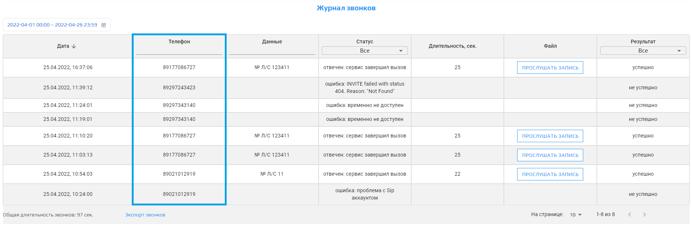

### Данные

В поле **Данные** указывается данные, которые мы получаем из звонка.

### Статус

В поле указывается один из статусов звонков (Все,отвечен,отменен,ошибка) и дополнительная информация().

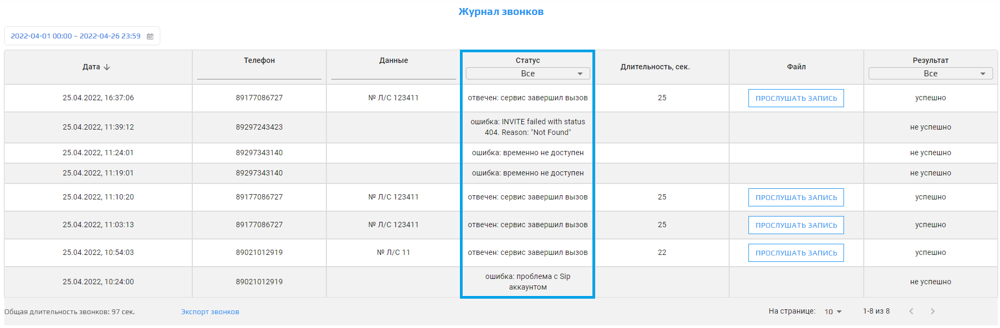

1. Выбрав **Все**, отобразятся все статусы звонков.  
2. Выбрав **Отвечен**, отображается статус "Отвечен"и дополнительная информация присваивается в следующих ситуациях:
* "Отвечен: сервис завершил вызов" - когда звонок был принят и сценарий звонка был пройден до конца.  
* "Отвечен: абонент положил трубку" - когда звонок был принят, но клиент положил трубку раньше, чем закончился сценарий звонка.
3. Выбрав **Отменен**, отображается статус "Отменен" и дополнительная информация присваивается в следующих ситуациях:
* "Отменен: абонент не взял трубку"- когда звонок состоялся,  но абонент сбросил звонок.  
* "Отменен: нулевой баланс сервиса"- когда по запущенному сервису нулевой баланс и требуется оплата.
4. Выбрав **Ошибка**, отображается статус "Ошибка" и дополнительная информация присваивается в следующих ситуациях:
* "Ошибка: временно не доступен" - когда абонент недоступен, введенный номер не существует или записан в неправильном формате.  
* "Ошибка: абонент занят" - абонент уже разговаривает с кем-то.  
* "Ошибка: не смогли дозвониться до абонента" - абонент не поднял трубку от нашего сервиса.

🛈 При выборе одного из пунктов в выпадающем списке и при нажатии на **Экспорт**, скачанный файл будет содержать данные только тех звонков, которые были отфильтрованы выбранным пунктом.

### Длительность

В поле указывается длина звонка в секундах.  
🛈 Данные могут отличаться +-1 сек.

### Файл

В этом поле находится проигрыватель записи звонка.  
В его функции входит:  
1. Включение/выключение проигрывания записи.  
2. Перемотка по временной шкале.  
3. Увеличение/Уменьшение громкости.  
4. Заглушить запись.  
5. Скачать запись в формате *wav.  
6. Настраивать скорость воспроизведения.  

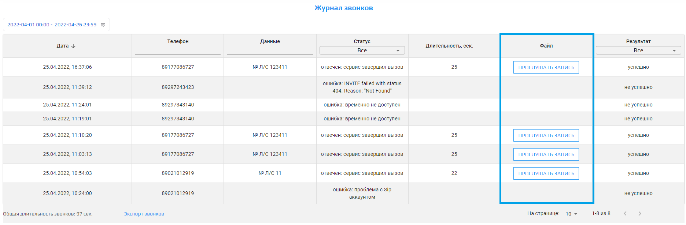

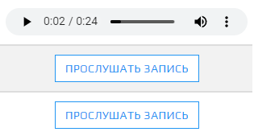

🛈 Для скачивания аудиозаписи и настройки скорости воспроизведения необходимо нажать на три вертикальных точки справа.

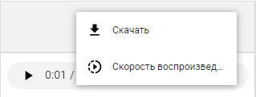

### Результат

В этом поле отображается результат выполнения ОД:
1. Успешно - когда робот полностью проговорил информацию о задолженности для абонента и завершил звонок.
2. Неуспешно - когда:

* Звонок не состоялся.
* Абонент не поднял трубку.
* Абонент поднял трубку, но сбросил звонок, до момента, когда робот закончит проговаривать информацию о задолженности.

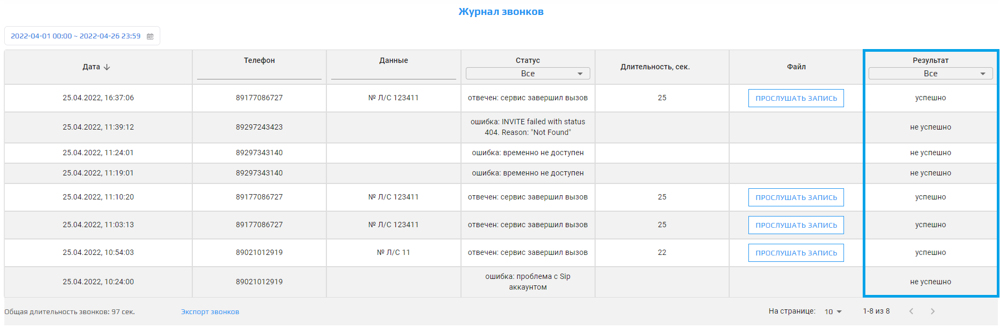

### Общая длительность

Отображает общую длительность звонков отображенных в таблице "Журнал звонков" в секундах

### Экспорт звонков

После нажатия на кнопку **Экспорт звонков** данные из таблицы экспортируются в файл в формате **.xls**, в котором будут все данные из таблицы.  
🛈 При выборе одного из пунктов в выпадающем списке у полей таблицы и при нажатии на **Экспорт звонков**, скачанный файл будет содержать данные только тех звонков, которые были отфильтрованы выбранным пунктом. 

Формат экспортируемый таблицы:

| Дата, время            | Телефон     | Статус    | Данные           | Длительность  | Результат
| ---------------------- | ----------- | -------------------- | --------- | ------           | ------------- |
| 2022.04.21 12:38:28   | 7929ХХХХХХХ | отвечен: сервис завершил вызов |     номер лицевого счета: 11    | 33 сек        | Успешно

## Панель Управления по таблице содержит:

### Кнопка "Вернуться на предыдущую страницу"

После нажатия на кнопку **Вернуться на предыдущую страницу**  откроется предыдущая страница по счету таблицы.  
🛈 Тусклая кнопка означает что вы уже на первой странице или таблица всего имеет 1 страницу.

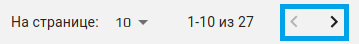

### Строки

Параметр **Строки** показывает количество строк в таблице. 
🛈 Этот параметр связан с параметром **Строк на странице**, чем больше строк на странице, тем меньше размещено страниц в таблице.

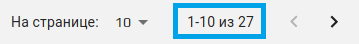

### Перейти на следующую страницу

После нажатия на кнопку **Перейти на следующую страницу** откроется следующая страница по счету таблицы.  
🛈 Тусклая кнопка означает, что открыта последняя страница или таблица всего имеет 1 страницу.

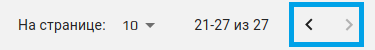

### Строк на странице и выпадающий список

Настройка **Строк на странице** отображает количество строк в таблице, из выпадающего списка можем выбрать одно из несколько значений: 10, 20, 50, 100, 500.  
🛈 Этот параметр связан с **параметром Страницы.**, чем больше строк на странице, тем меньше отображается страниц в таблице.

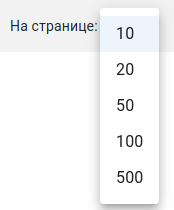
