Раздел **Профиль** расположен в **Инфопанели** и представляет собой модальное окно, в котором происходит **Смена настроек SIP подключения**, **Изменение количества линий**, **Сохранение изменений SIP аккаунта**, **Проверка SIP-соединения**, **Пополнение баланса**, **Изменение имени пользователя**, **Изменение пароля** клиента.

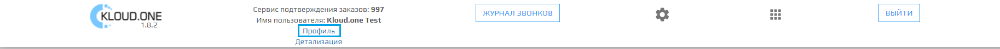

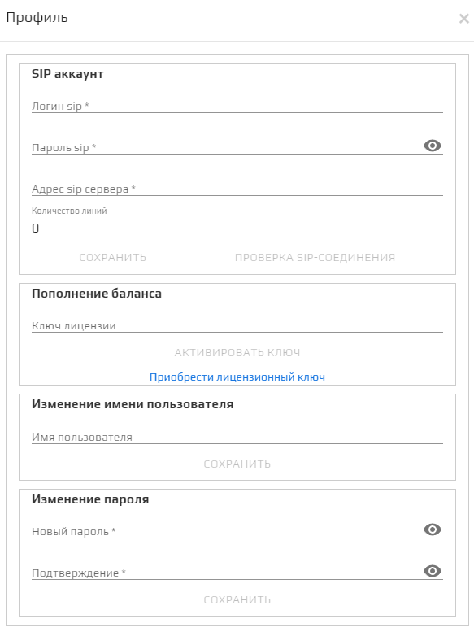

## Логин SIP:

В этом поле указывается логин SIP-подключения.
🛈 Для Мультфона логин это номер телефона.  
🛈 Для завершения смены логина SIP нажмите на кнопку **Сохранить**.  

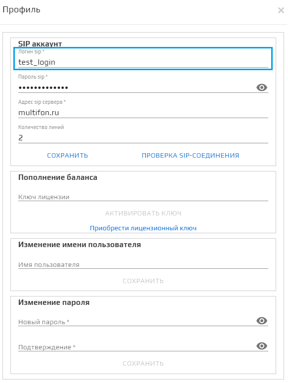

## Пароль SIP:

В этом поле указывается пароль SIP-подключения.  
🛈 Для завершения смены пароля SIP нажмите на кнопку **Сохранить**.  

## Адрес SIP сервера:

В этом поле указывается адрес сервера SIP-подключения.  
🛈 Для Мультфона это **multifon.ru**.  
🛈 Для завершения смены адреса SIP нажмите на кнопку **Сохранить**.  

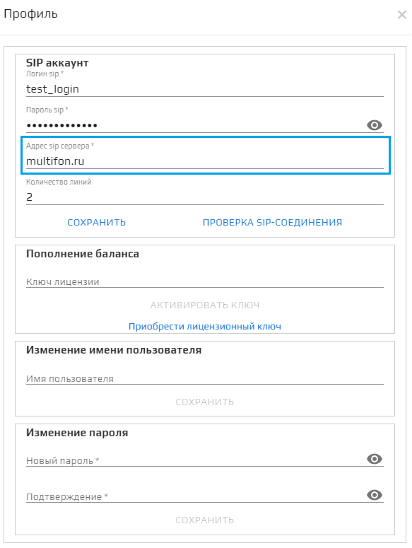

## Количество линий:

В этом поле указывается количество линий SIP-подключения.  
🛈 Не рекомендуется ставить количество линий больше имеющихся у вас линий IP-телефонии, так как это приведёт к ошибкам в звонках, связанным с нехваткой линий.  
🛈 Для завершения смены количества линий нажмите на кнопку **Сохранить**.  

## Сохранить:

Кнопка **Сохранить** сохраняет изменения, связанные с SIP-аккаунтом.  
🛈 Сохраняет изменения **Логин SIP**, **Пароль SIP**, **Адрес SIP сервера** и **Количество линий**.  

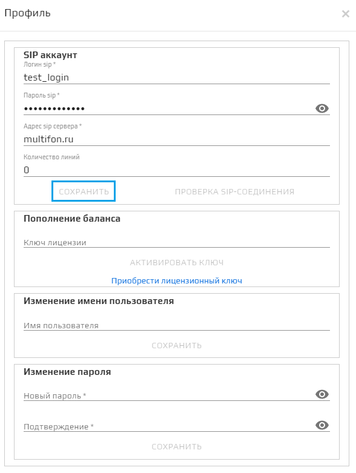

🛈 Кнопка **Сохранить** становится активной после внесения изменений в найстройки SIP-аккаунта.  

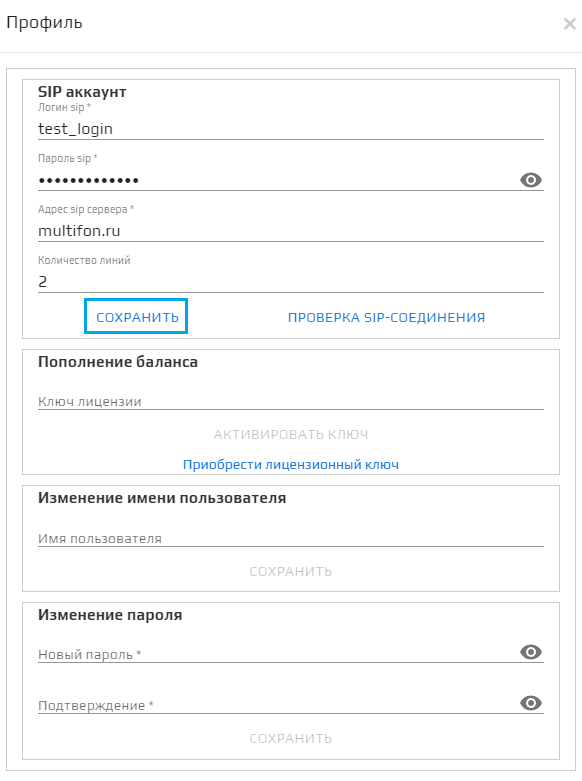

🛈 После нажатия на кнопку появится модальное окно, оповещающее об успешном обновлении профиля, для продолжения нажмите **ОК**.  

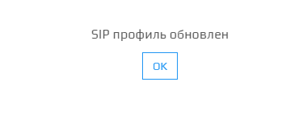

## Проверка SIP-соединения:

Кнопка **Проверки SIP-соединения** отображает во всплывающем окне статус SIP-соединения относительно правильности введенных данных в **SIP аккаунт**. Также отображает, в какое время была запущена проверка.  
* Статус **зарегистрирован** означает, что все данные SIP аккаунта введены верно и он готов к работе сервиса.  
* Статус **не зарегистрирован** означает, что какие-то данные SIP аккаунта введены неверно и вам следует внимательнее их проверить.  
* Статус **Ошибка! Обратитесь в техподдержку** означает, что у сервиса возникли проблемы, и вам следует обратиться в техподдержку для решения этого вопроса.

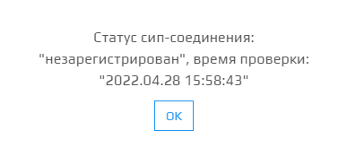

## Пополнение баланса:

Поле **Ключ лицензии** предназначено для ввода буквенно-цифрового кода, при активации которого пополняется баланс.  
🛈 Для активации лицензионного ключа необходимо нажать **АКТИВИРОВАТЬ КЛЮЧ**.  
🛈 По ссылке **Приобрести лицензионный ключ** можно перейти на сайт платформы Kloud.One и приобрести подходящую лицензию.  

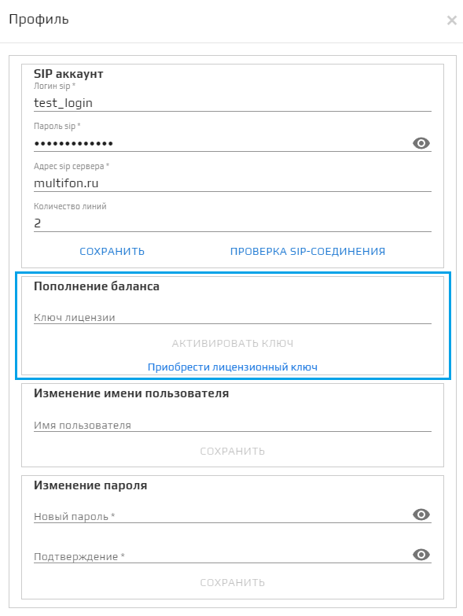

## Изменение имени пользователя:

Поле **Изменение имени пользователя** предназначено для изменения имени пользователя, указанного при регистрации в сервисе Trusted.ID. Имя пользователя изменится только в приложениях ППС, ОД, ПЗ.

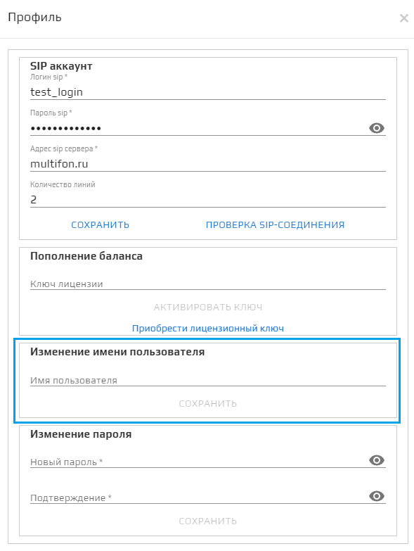

## Новый пароль:

Поле для ввода нового пароля. Это пароль, используемый для интеграции с интернет-магазином.

🛈 Это не пароль от личного кабинета!

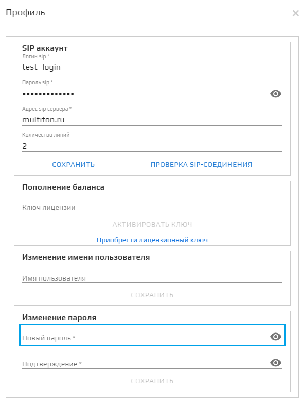

## Подтверждение:

Поле дублирует поле **Новый пароль** для подтверждения нового пароля. Для завершения смены пароля нажмите на кнопку **Сохранить**.   

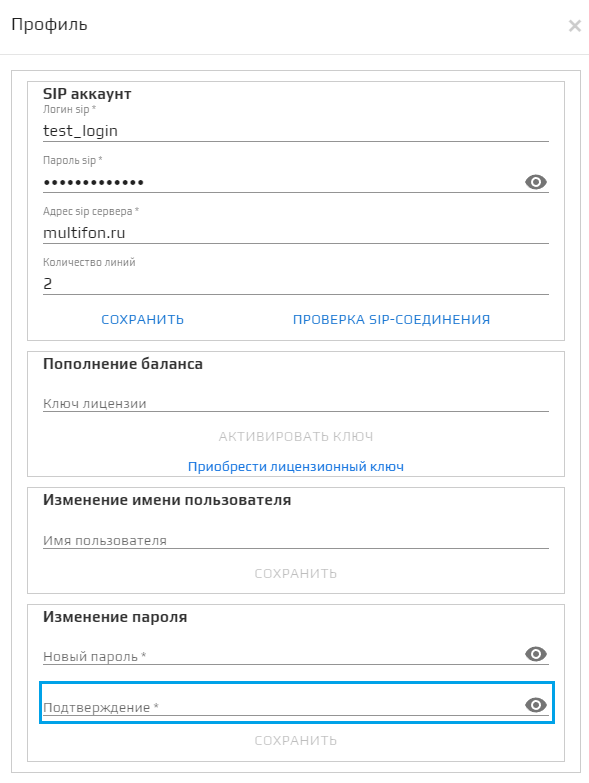

## Кнопка Сохранить

Сохраняет новый пароль, если поля **Новый пароль** и **Подтверждение** совпадают.

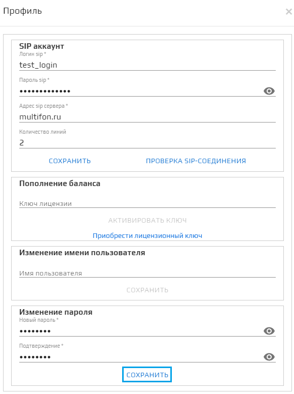

После успешной смены пароля откроется модальное окно **Профиль успешно обновлен**, нажмите **ОК** для закрытия модального окна. 
