**Подтверждение заказов** или **ПЗ** является одним из приложений платформы Kloud.One, отвечающим за выполнение звонка покупателю для подтверждения заказа в интернет-магазине.

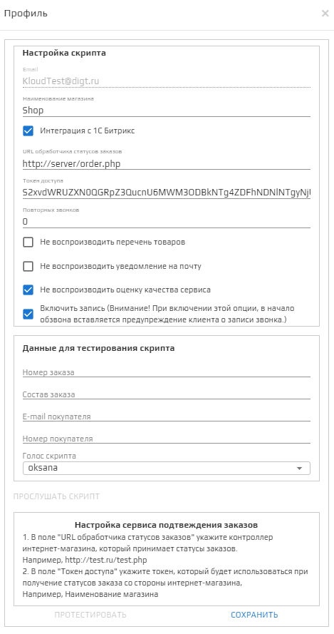

## Блок Настройка скрипта

В блоке **Настройка скрипта** производится настройка сценария для голосового сообщения, используемого при обзвоне для подтверждения заказа, а также в данном блоке настраивается **URL обработчика статусов заказов** (разработчиком или администратором интернет-магазина), и автоматически генерируется **Токен доступа** для получения статусов заказа интернет-магазина.

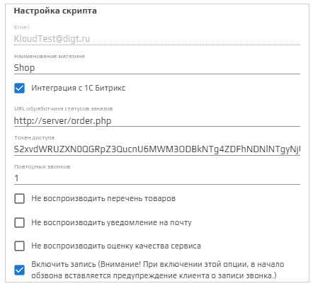

### Поле Email

В этом поле находится неактивное поле с электронным адресом, на который был зарегистрирован аккаунт. 

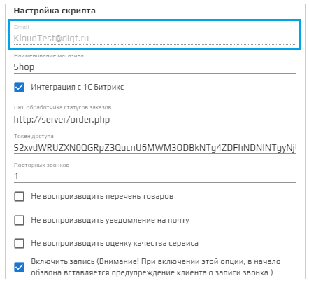

### Поле Наименование магазина

В данном поле необходимо написать название магазина. Это название будет проговариваться в голосовом сообщении пользователю. Для произнесения доступны два языка: русский и английский.
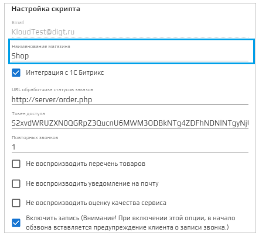

## Раздел Интеграция с 1С-Битрикс

В этом разделе находятся поля с настройками подключения 1С-Битрикс. Эти данные используются для подключения 1С. 

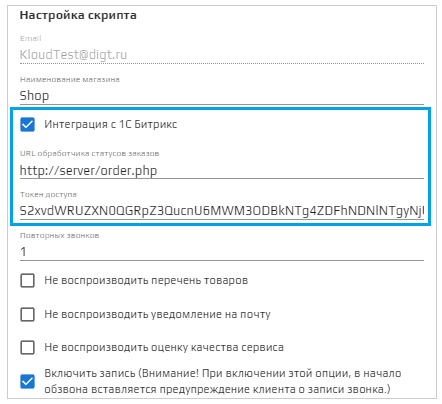

### Поле URL обработчика статусов заказов

Данное поле настраивается на стороне интернет-магазина. Указывается адрес обработчика интернет-магазина. Обработчиком служит URL, который будет вызван после того как пользователь подтвердит или отменит заказ при входящем звонке.

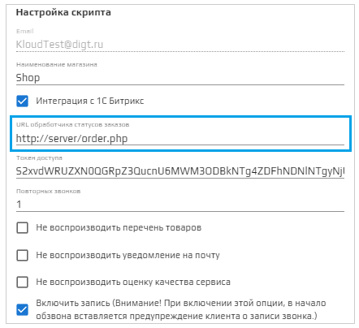

### Поле Токен доступа

Представляет собой автоматически сгенерированный ключ, который можно изменить или заменить на свой. Он будет отправлен сервисом вместе с информацией о статусе заказа. Подробности приведены в блоке "Описание запроса" (см. ниже).

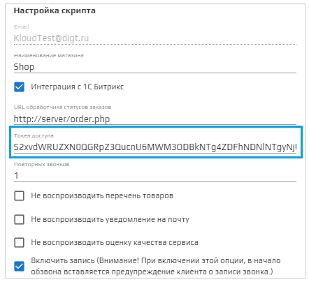

### Поле Повторных звонков

В данном поле необходимо установить количество звонков, которое будет совершено для достижения успешного результата (абонент ответил на звонок). Максимальное количество возможных звонков - 4. Повторные звонки в поле записываются в числовом формате.

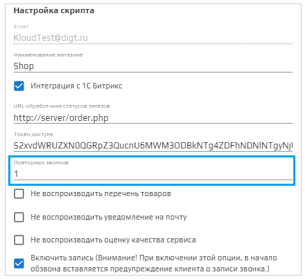

### Флажок Не воспроизводить перечень товаров

Если флажок активирован, при звонке в голосовом сообщении будет озвучен только номер заказа. Состав заказа озвучен не будет. 

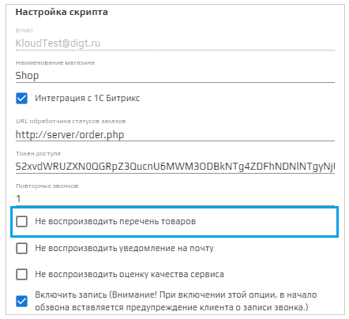

### Флажок Не воспроизводить уведомление на почту

При активированном флажке сообщение об отправленном уведомлении на почту озвучено не будет. Уведомления на почту могут включать в себя выставленный счет или сведения об оформленном заказе.

### Флажок Не воспроизводить оценку качества сервиса

При неактивированном флажке скрипт включает в себя просьбу оценить удовлетворенность сервисом и возможность озвучить свое мнение в случае, если сервис клиента не удовлетворил. 

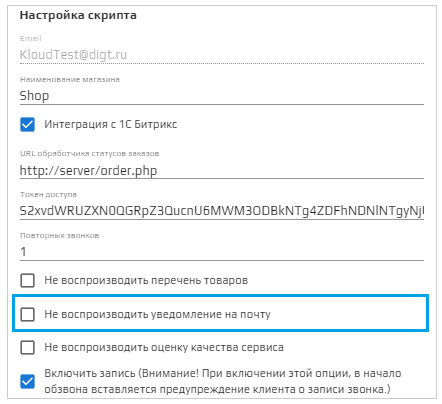

### Флажок Включить запись

При активации флажка будет вестись запись звонков. В начале звонка клиент будет предупрежден о проводимой записи разговора.

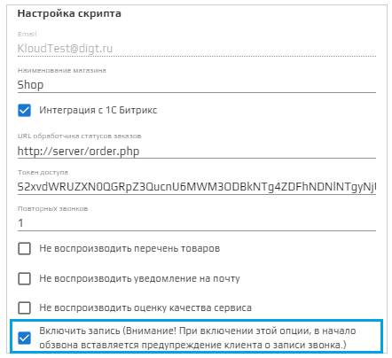

## Блок Данные для тестирования скрипта 

Данный блок предназаначен для тестирования и прослушивания скрипта. В полях задаются параметры, необходимые для тестирования.

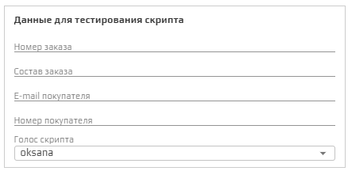

Пример заполненного скрипта для тестирования: 

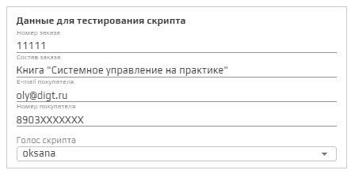

##### Поле Номер заказа

Данное поле заполняется произвольно, в числовом формате.

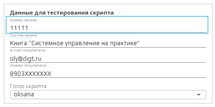

##### Поле Состав заказа

В этом поле необходимо написать номенклатурное название заказанного товара.

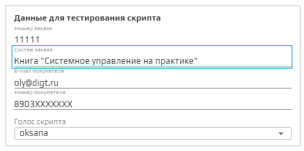

##### Поле Email покупателя

Поле предназначено для адреса электронного почтового ящика, на который будет выслано уведомление. 

🛈 Уведомление отправляется интернет-магазином или учетной системой. Приложение только информирует о наличии уведомления.

🛈 Если при тестировании флажок **Не воспроизводить уведомление на почту** включен, фраза при тестировании скрипта озвучена не будет.

##### Поле Номер телефона покупателя

В этом поле вводится номер телефона, на который будет совершен тестовый звонок сервиса подтверждения заказа. Для тестирования может быть использован собственный номер. 

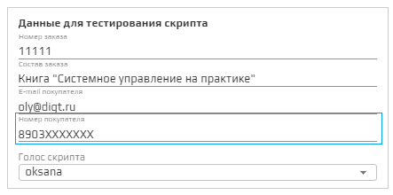

##### Выпадающий список Голос скрипта

В модуле ПЗ имеется 5 голосов для автоответчика:  **Jane**, **Oksana**, **Omazh**, **Zahar**, **Ermil**.  
Голоса отличаются по полу, тембру и скорости произнесения речи.  
🛈 По умолчанию стоит голос **oksana**. 

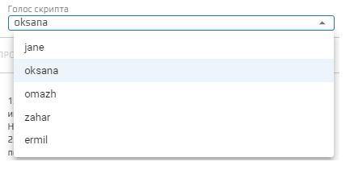

##### Кнопка Прослушать скрипт 

При нажатии кнопки **Прослушать скрипт** можно прослушать тестовый вариант звонка. 

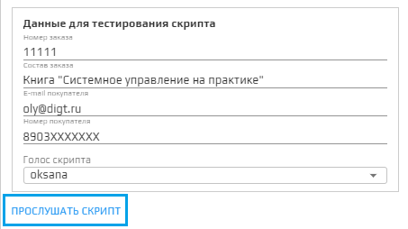

## Блок Описание запросов и Настройка сервиса подтверждения заказов

Данный блок представляет собой описание параметров, необходимых для корректного взайимодействия голосового сервиса Kloud.One и интернет-магазина.

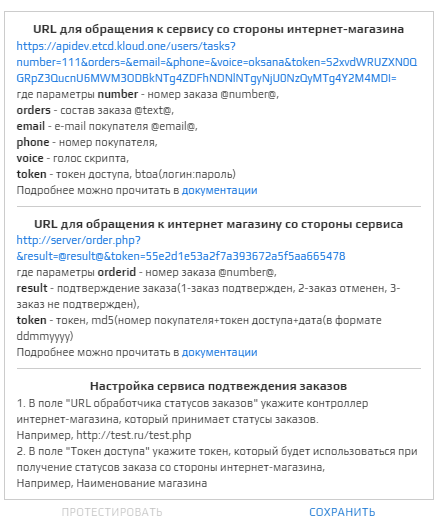

В **Описании запросов** в блоке **URL для обращения к сервису со стороны интернет-магазина** указаны параметры, которые интернет-магазин должен включить в запрос к приложению Kloud.One.

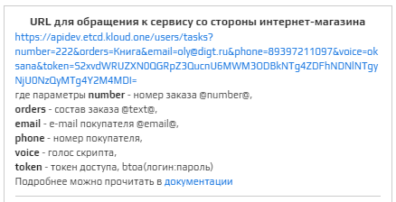

В **Описании запросов** в блоке **URL для обращения к интернет магазину со стороны сервиса** указаны параметры, которые приложение Kloud.One передает интернет-магазину. 

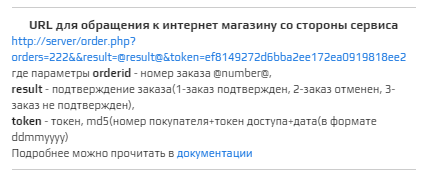

В следующем разделе описаны действия для **Настройки сервиса** Подтверждения заказов.

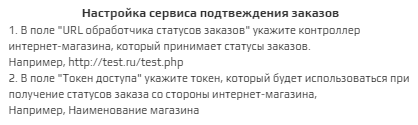

### Кнопка Протестировать

При нажатии кнопки **Протестировать** на номер телефона, введенный в блоке **Тестирования скрипта**, через три минуты поступает тестовый звонок от сервиса **Kloud.One**.

🛈 По умолчанию кнопка **Протестировать** неактивна.

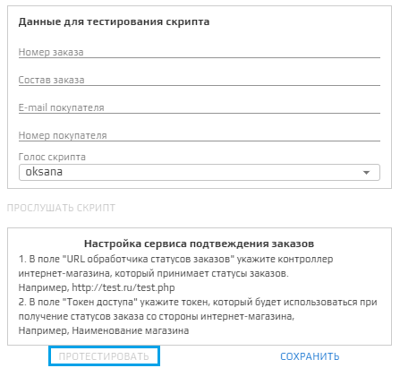

При заполнении полей блока **Данные для тестирования скрипта** открывается блок **Описание запросов**, кнопка **Протестировать** становится активной.

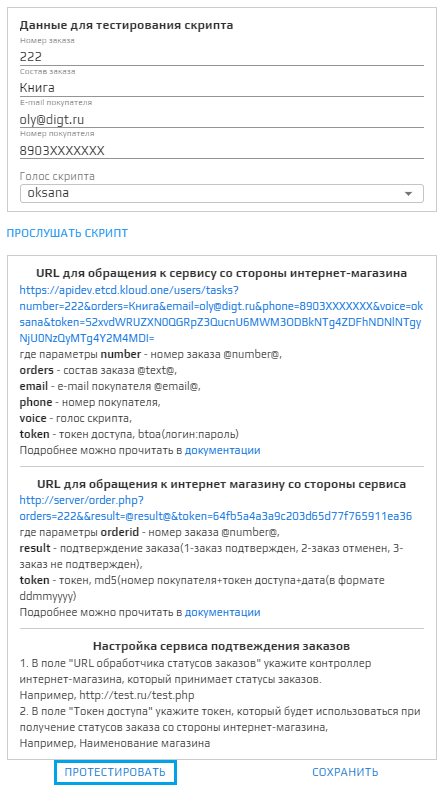

### Кнопка Сохранить

При нажатии на кнопку **Сохранить** сохраняются новые или измененные настройки сервиса (**Блок настройки скрипта**, **Блок Интеграция с 1С-Битрикс**). Настройки блока **Данные для тестирования скрипта** не сохраняются.

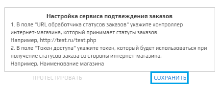
