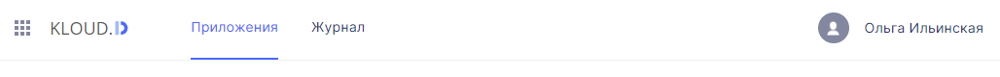

## Панель навигации содержит следующие элементы:

1. Иконка **Приложения платформы Kloud.One**  
2. Логотип   
3. Вкладка **Приложения**    
4. Вкладка **Журнал**    
5. Кнопка **Имя пользователя**   

