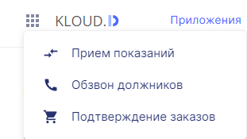

## Переход к приложениям платформы Kloud.One в Личном кабинете

#### Иконка Переход к приложениям платформы Kloud.One в Личном кабинете

Иконка для перехода в другие приложения платформы Kloud.One (**Прием показаний**, **Обзвон должников**, **Подтверждение заказов**) расположена в левой верхней части личного кабинета.

#### Список приложений платформы Kloud.One

Иконка при нажатии на нее представляет собой выпадающий список приложений платформы Kloud.One.

При выборе одного из приложений открывается личный кабинет выбранного приложения.