## Вкладка Приложения содержит:

Вкладка **Приложения** представляет собой веб-страницу с небольшим описанием решения **Авторизация по звонку** и тремя блоками: **Баланс**, **Учетные данные**, **Приложения**.

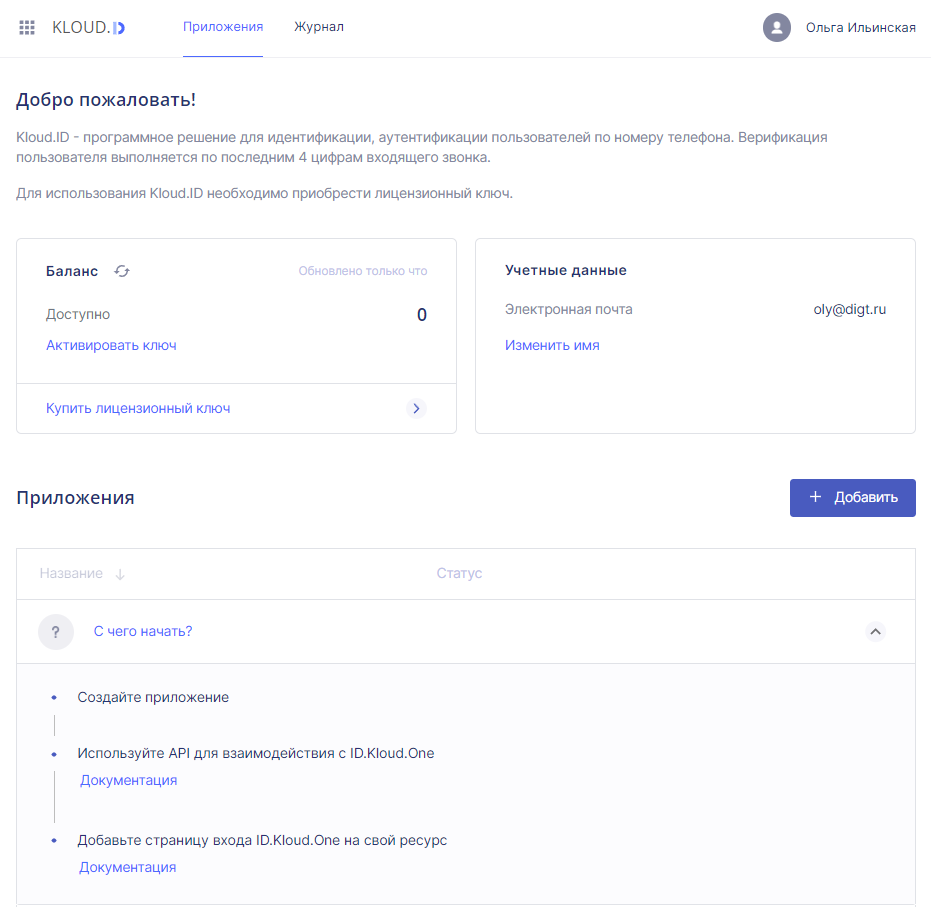

### Описание продукта

Приложение **Авторизация по звонку** предназначено для аутентификации пользователей по входящему звонку в веб-ресурсах и приложениях. В описании продукта кратко описан принцип работы приложения. Для корректной работы приложения необходимо приобрести лицензионный ключ. Ссылка на покупку и поле для активации находятся в блоке **Баланс** ниже.

## Блок Баланс

В блоке **Баланс** можно:
- увидеть баланс (единица баланса - один исходящий звонок с кодом);  
- активировать приобретенный лицензионный ключ (пробную или коммерческую лицензию);  
- перейти по ссылке, чтобы купить лицензионный ключ (ссылка ведет на сайт Kloud.One https://kloud.one/id/). В блоке представлены все виды коммерческих лицензий для сравнения и выбора наиболее подходящей). Также на сайте есть возможность заказать тестовую лицензию.

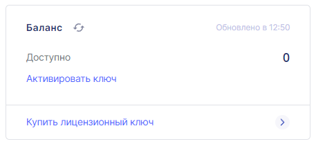

### Кнопка Обновить и Статус обновления

При нажатии на кнопку **Обновить** обновляется баланс. 

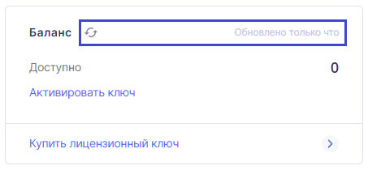

Статус обновления фиксируется справа. 

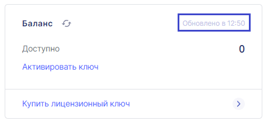

### Поле Доступно

В поле Доступно можно увидеть баланс. При расходовании единиц баланса их количество пропорционально уменьшается. 

### Поле Активировать ключ

При нажатии на кнопку **Активировать ключ** открывается поле **Введите лицензионный ключ**. Следует копировать лицензионный ключ и вставить его в открывшееся поле.

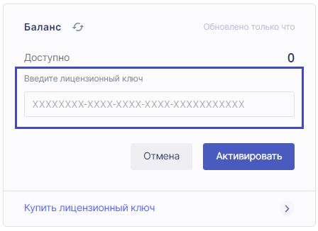

🛈 Обязательно должен быть соблюден формат лицензионного ключа при введении! 

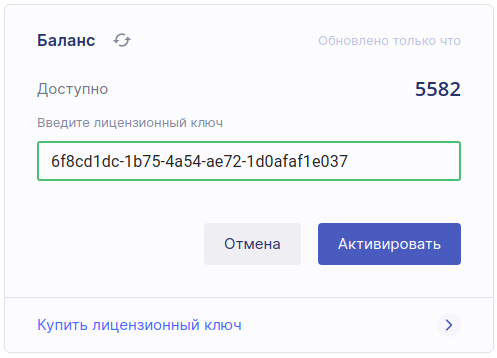

### Ссылка Купить лицензионный ключ

При нажатии на ссылку **Купить лицензионный ключ** открывается тарификация на сайте Kloud.One.

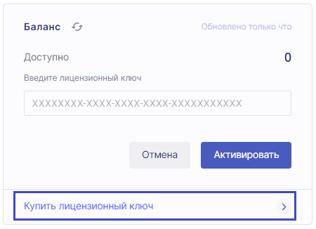

На сайте Kloud.One можно сравнить доступные к приобретению лицензии и приобрести выбранный вариант, перейдя на карточку товара и нажав **Купить**.

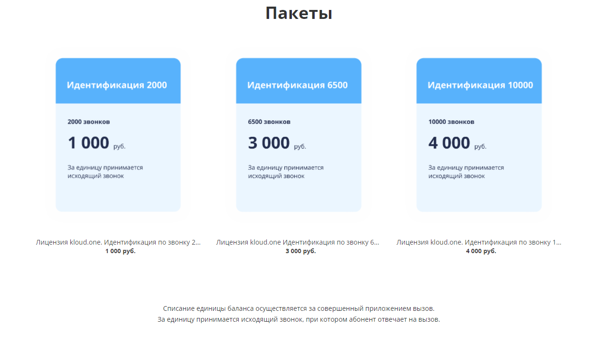

Карточка товара включает в себя номенклатурное название, состав пакета, описание и блок с ценой и кнопкой **Купить**.
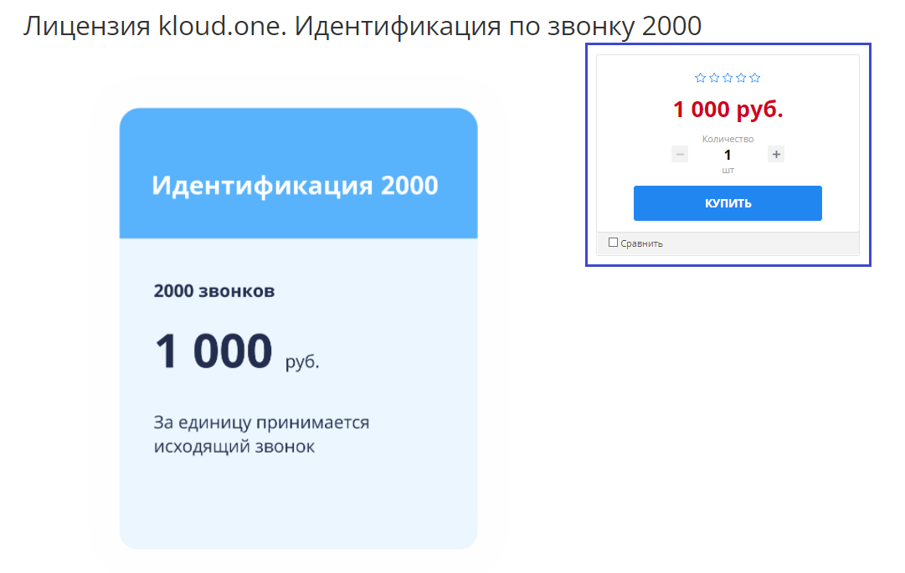

## Блок Учетные данные

В блоке **Учетные данные** находится адрес электронной почты, на которую зарегистрирован аккаунт, и кнопка **Изменить имя**. При нажатии кнопки **Изменить имя** появляется возможность поменять имя, указанное при регистрации, в личном кабинете.

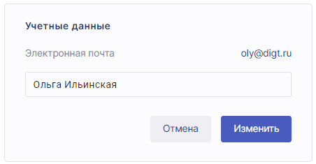

## Блок Приложения

В блоке **Приложения** пользователь может добавить и настроить свои приложения для работы с модулем Kloud.ID.

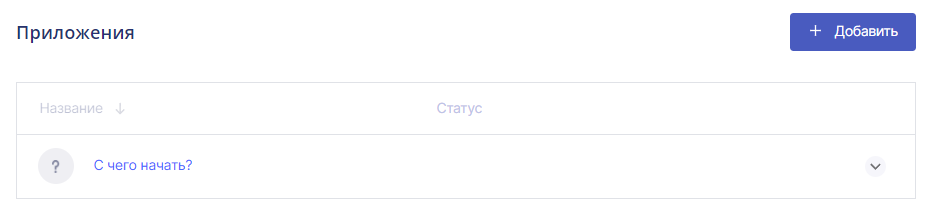

Для удобства пользователей в блоке есть небольшая инструкция **С чего начать?**.

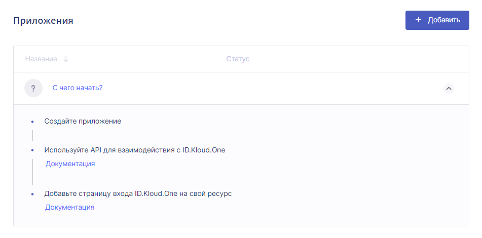

Для добавления приложения необходимо нажать кнопку **Добавить**. Откроется модульное окно **Добавить приложение**.

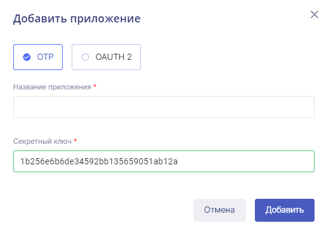.

Раздел **OTP** (One Time Password) содержит поля **Название приложения** и **Секретный ключ**.  **Секретный ключ** нужен для настройки **Авторизации по звонку** на стороне клиента. 

Раздел **OAUTH 2** позволяет настроить простой виджет для входа по звонку. 

Название приложения выбирается по желанию (например, это может быть название интернет-магазина или веб-ресурса), но обязательно для заполнения.

При настройке данных полей аутентификация будет происходить следующим образом: пользователь будет вводить на сайте в открывшийся виджет входа свой номер телефона, затем ему будет отправлен звонок от сервиса **Авторизация по звонку**. После ввода 4 последних цифр в поле виджета он будет перенаправлен на страницу, зафиксированную в поле **Адрес авторизации в приложении (callback) для OAUTH 2**.

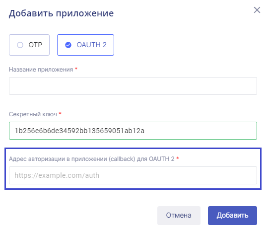

**Секретный ключ** используется для аутентификации приложения в сервисе **Авторизация по звонку**. Он нужен для настройки подтверждения доступа на стороне клиента.

Итак, заполнение полей завершено.

После добавления приложения его можно увидеть в нижней части блока.

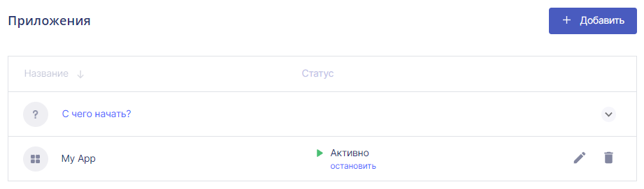

Если нажать на свободную область в добавленном приложении, то раскрываются данные для настройки приложения.

## Настройки приложения

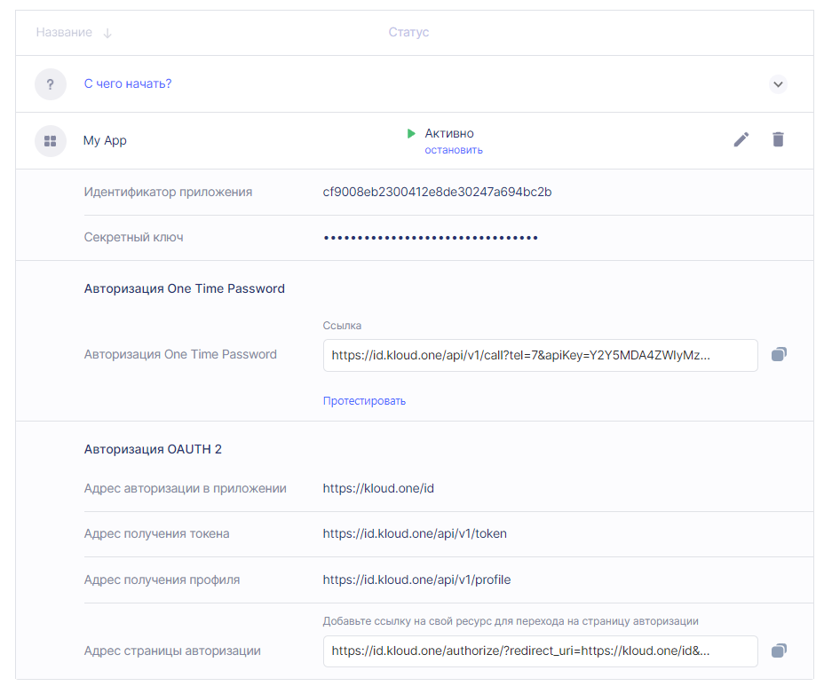

В верхней части настроек представлены **Идентификатор приложения** и **Cекретный ключ**. Это учетные данные приложения.

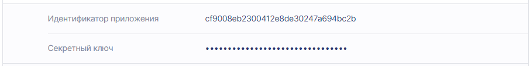

**Идентификатор приложения** (Client ID) представляет собой публично доступную строку, которая используется API сервиса для идентификации приложения, а также используется для создания авторизационных URL для пользователей. 

**Секретный ключ** (Client Secret) используется для аутентификации подлинности приложения для API сервиса, когда приложение запрашивает доступ к аккаунту пользователя. **Секретный ключ** должен быть известен только приложению и API.

**Авторизация One Time Password** включает в себя поле со сгенерированной ссылкой и кнопкой **Протестировать**.

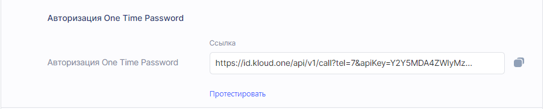

При нажатии на кнопку **Протестировать** открывается поле для ввода номера телефона.

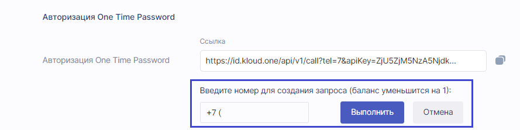

 Сгенерированная ссылка включает в себя параметры, необходимые для авторизации приложения, и номер телефона, на который будет произведен звонок.

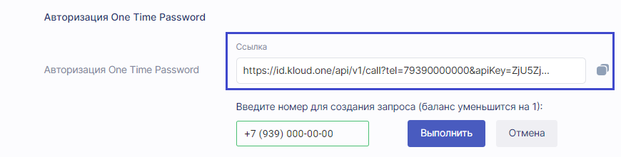

При открытии этой ссылки можно увидеть статус запроса приложения к сервису Kloud.One и код верификации.

При нажатии на кнопку **Выполнить** происходит переход по сгенерированной ссылке со статусом и кодом.

**Авторизация OAUTH 2**

В данном разделе блока настроек представлены адреса, которые используются при настройке авторизации по спецификации OAuth 2.0 на стороне клиента.

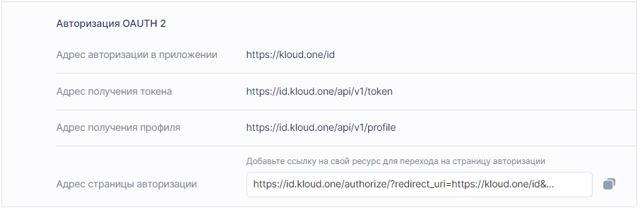

**Адрес авторизации приложения** подтягивается из настроек, созданных при добавлении приложения в модульном окне **Добавить приложение**.

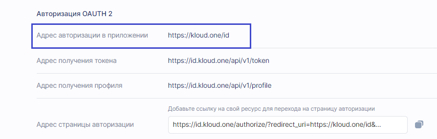

**Адрес получения токена** и **Адрес получения профиля** используются для настройки авторизации. 

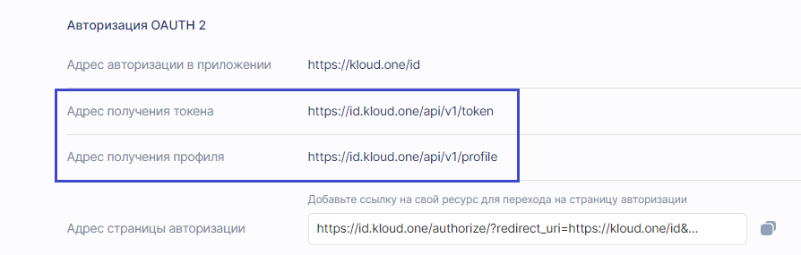

По ссылке **Адрес страницы авторизации** открывается виджет с полем для ввода номера телефона.

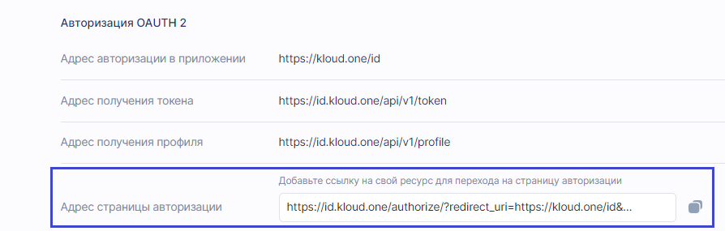

При вводе номера в виджете при нажатии на кнопку **Войти** появляется поле для ввода кода, а на телефон поступает звонок.

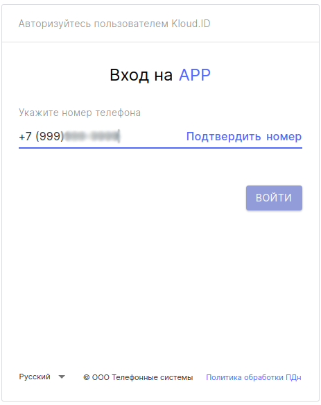

 В поле для ввода кода необходимо ввести последние четыре цифры входящего номера. При нажатии на кнопку **Войти** пользователь переходит на страницу с адресом, указанным в поле **Адрес авторизации приложения**. 

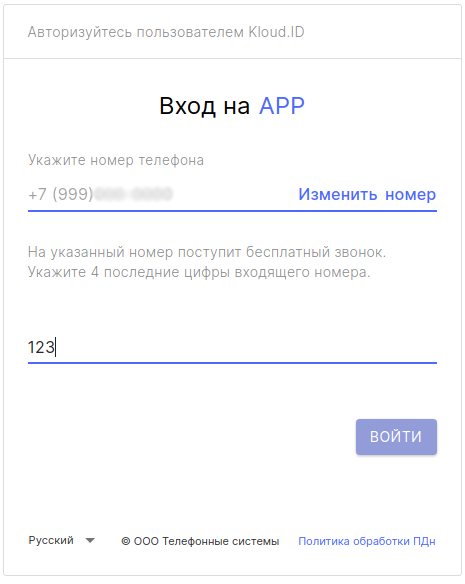

