## Вкладка Журнал 

Вкладка **Журнал** включает в себя два подраздела: собственно **Журнал** с отчетной таблицей по произведенным аутентификациям, и подраздел **Активированные лицензии**, который отражает отчетность по работе с лицензионными ключами (дату пополнения, ключ, количество звонков, статус ключа).

### Подраздел Журнал

Подраздел **Журнал** включает в себя виджет фильтрации приложений, виджет выбора отчетного периода по датам, и поиск номера. Ниже располагается таблица **Журнал**, включающая в себя столбцы **Дата**, **Сервисный номер**, **Телефон**, **Статус**.

#### Виджет Сортировки приложений

Виджет фильтрации приложений позволяет выбрать приложение, отчетность по которому будет представлена в таблице.

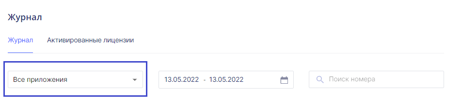

При нажатии на виджет раскрывается выпадающий список, в котором можно выбрать нужное приложение.

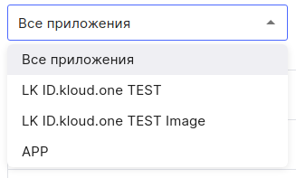

#### Виджет Выбор отчетного периода

Над таблицей в средней части расположен виджет выбора даты. Для выбора необходимого периода для просмотра отчета необходимо кликнуть на поле с датами и иконкой календаря. 

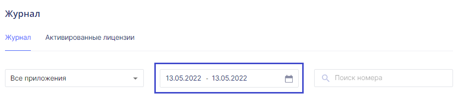

Открывается календарь, включающий в себя текущий месяц. В календаре выбираются первая и последняя даты отчетного периода. Для подтверждения верности выбранного периода и просмотра отчета необходимо нажать кнопку **Применить**.

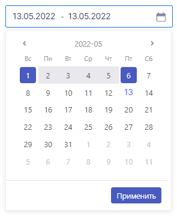

#### Поиск номера

Данное поле позволяет найти номер телефона пользователей, прошедших аутентификацию по входящему звонку.

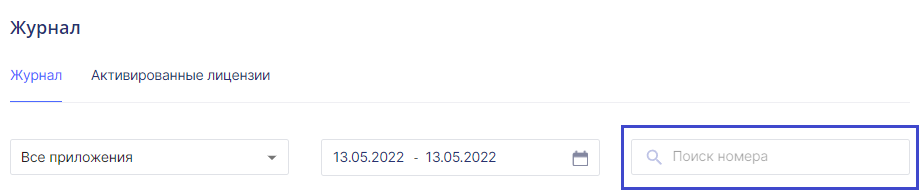

#### Таблица Журнал

В таблице представлена отчетность по совершенным аутентификациям за выбранный период. При желании можно настроить фильтрацию по приложениям - тогда будет настроена отчетность по выбранному приложению и\или отчетному периоду.

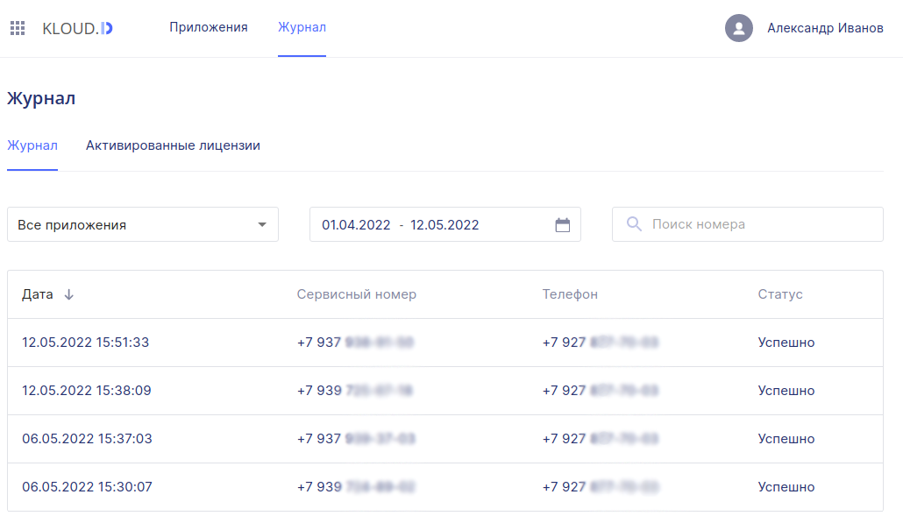

#### Сортировка

Иконка-стрелка рядом с названием столбца при переключении на данный столбец позволяет сортировать данные в числовом значении (даты и время, а также номера телефонов) по возрастанию и убыванию. 

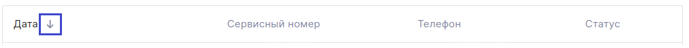

#### Столбец Дата

В столбце **Дата** отражена дата и время пройденной аутентификации. В поле указывается дата и время звонка в формате **ДД.ММ.ГГГГ**, **ЧЧ.ММ.СС**.

#### Столбец Сервисный номер

В данном столбце расположены поля с сервисными номерами входящих звонков. Последние четыре цифры являются кодом для аутентификации.

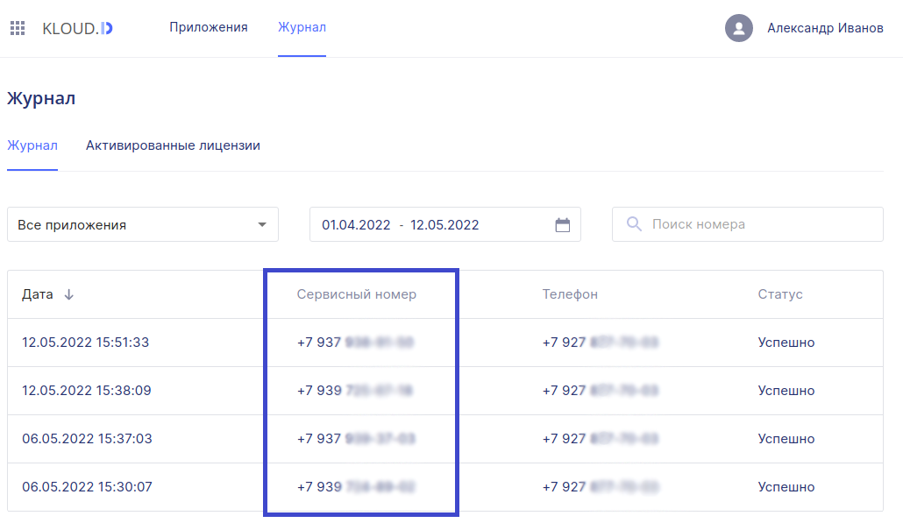

#### Столбец Телефон

В столбце **Телефон** находятся номера телефонов, на которые были совершены звонки от сервиса.

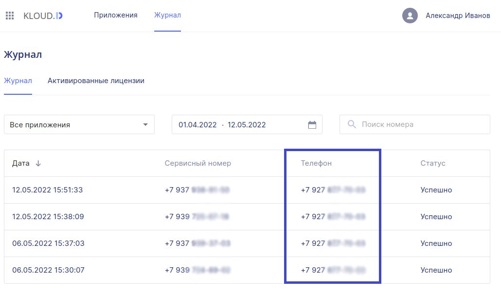

#### Столбец Статус

В столбце **Статус** отражается статус звонка:

**Успешно** - звонок поступил на телефон пользователя.

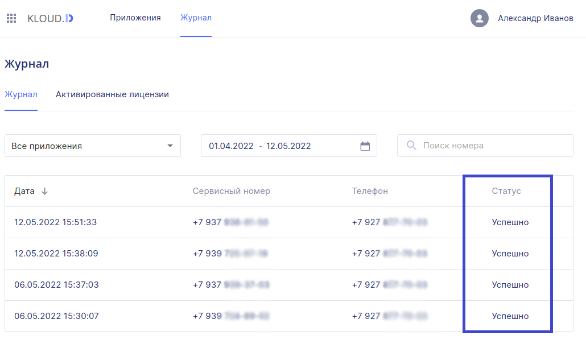

**Не успешно** - по каким-то причинам звонок не состоялся. Например, абонент в данный момент недоступен, или пользователь ввел некорректный номер телефона.

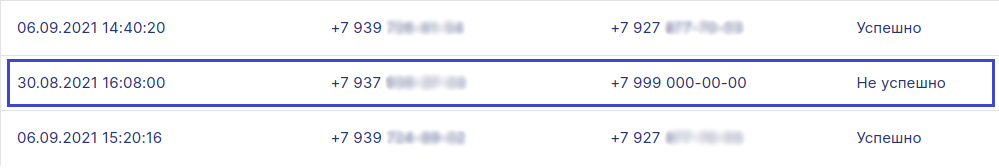

### Подраздел Активированные лицензии

В данном подразделе представлена информация об активированных лицензиях, а именно: **Дата пополнения**, **Лицензионный ключ**, **Количество звонков**, **Статус**.

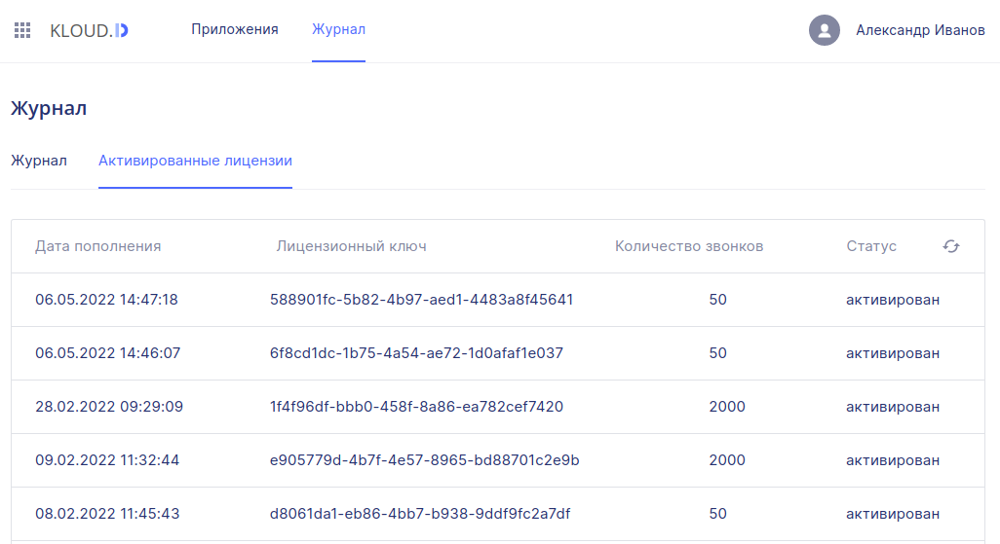

#### Столбец Дата пополнения

В столбце **Дата пополнения** указывается дата и время активации лицензионного ключа в формате **ДД.ММ.ГГГГ**, **ЧЧ.ММ.СС**.

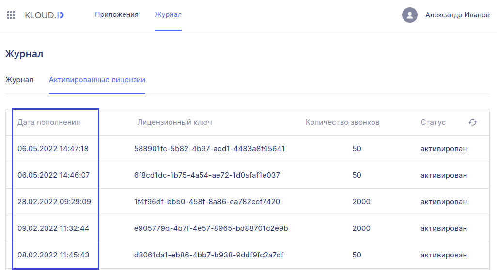

#### Столбец Лицензионный ключ

В столбце **Лицензионный ключ** находится список активированных лицензионных ключей.

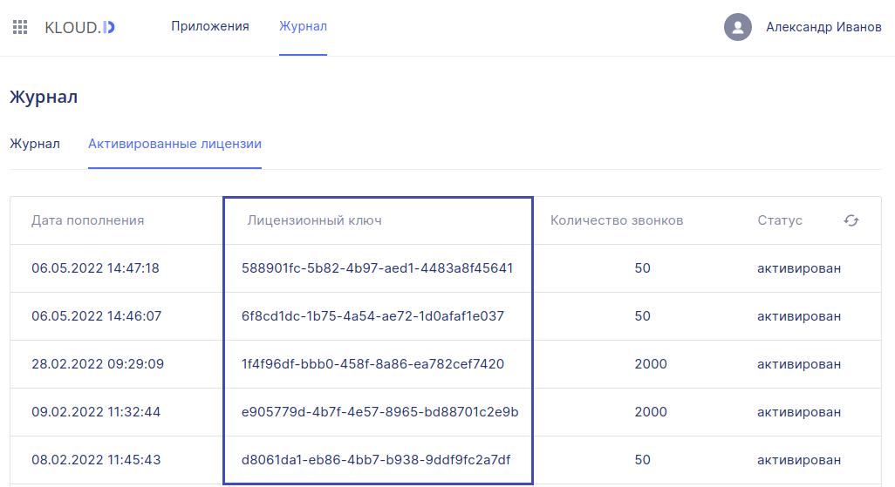

#### Столбец Количество звонков

В столбце **Количество звонков** расположена информация о том, на какое количество запросов был пополнен баланс приложения.

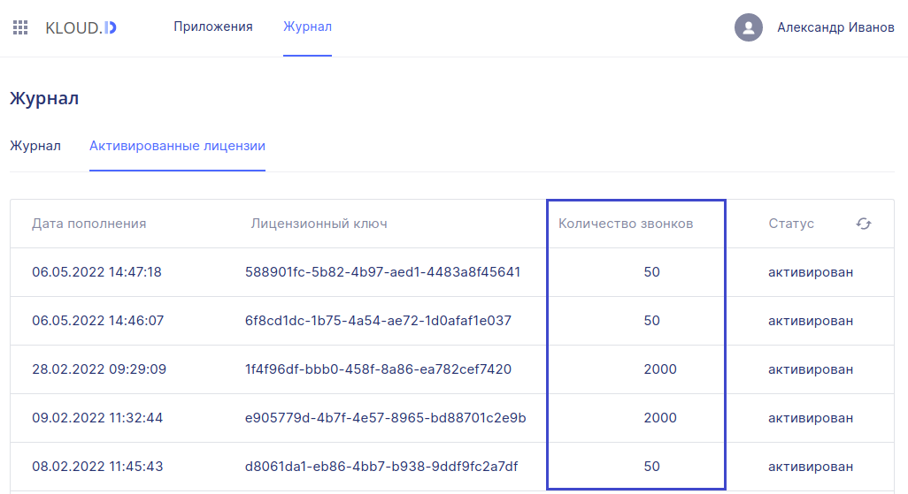

#### Столбец Статус

Статус **активирован** говорит об успешной активации приобретенного лицензионного ключа.

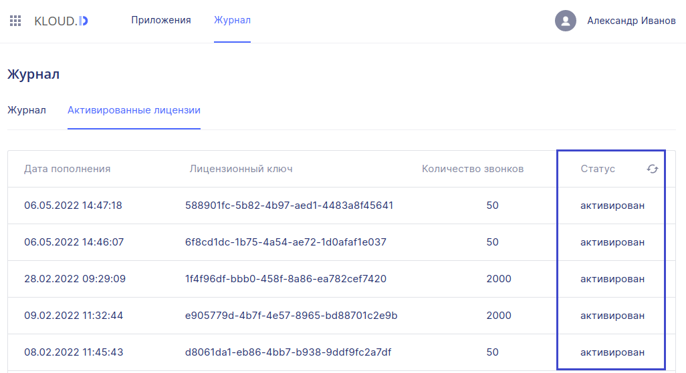
