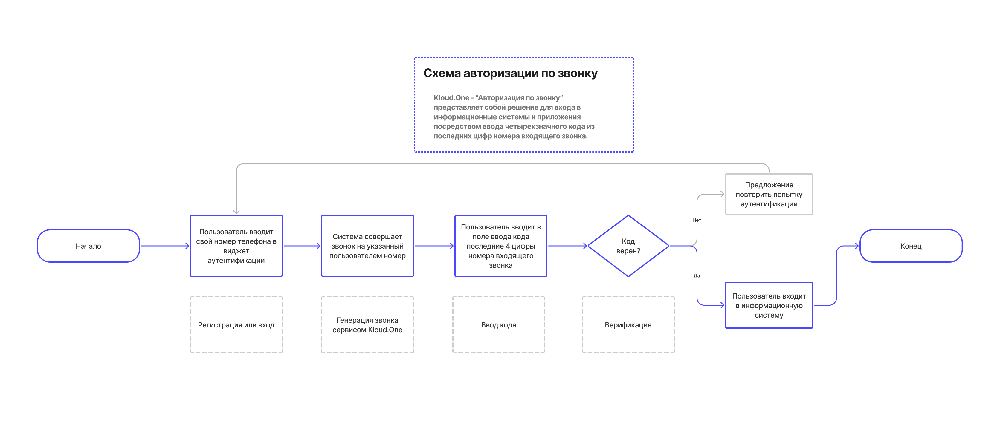

## Приложение Авторизация по звонку: путь пользователя

**Авторизация по звонку Kloud.One** - это вход в приложение или веб-ресурс посредством ввода пароля, состоящего из последних цифр номера входящего звонка.

Технологически процесс авторизации по звонку состоит из нескольких этапов:

1. Пользователь вводит свой номер телефона.

2. Система совершает звонок: дозвон на телефон пользователя осуществляется с одного из пула телефонных номеров на сервисе. Пул номеров объемен, каждый раз используется любой свободный номер, и этот пул расширяется в зависимости от нагрузки на систему.

3. Пользователь вводит четыре последние цифры номера входящего звонка. Цифры, как правило, уникальны. Каждый раз цифровой набор кода будет новым. Если код верен, система подтверждает авторизацию пользователя.

4. Система передает статус верификации, пользователь входит в свой кабинет. Верификация считается успешно завершенной.

### Схема авторизации по звонку

Авторизация по звонку