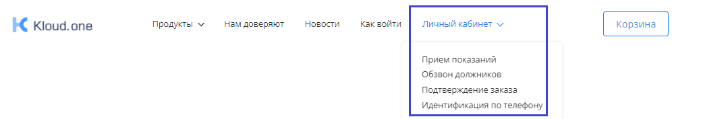
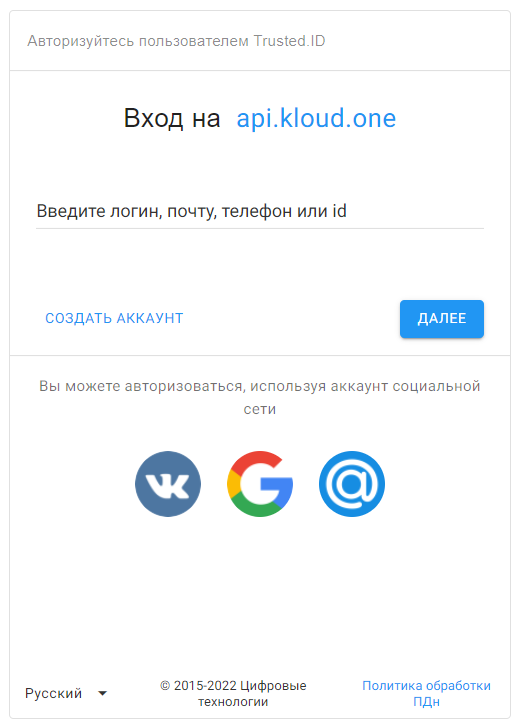
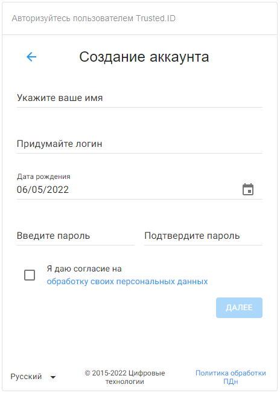
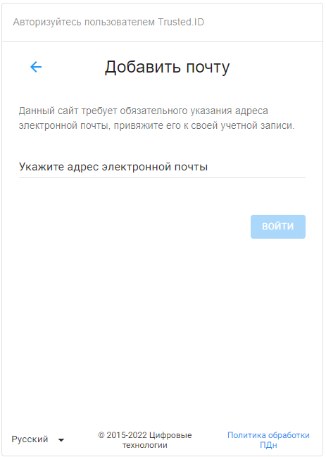
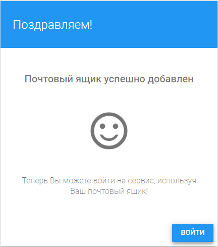
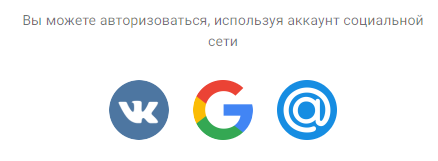
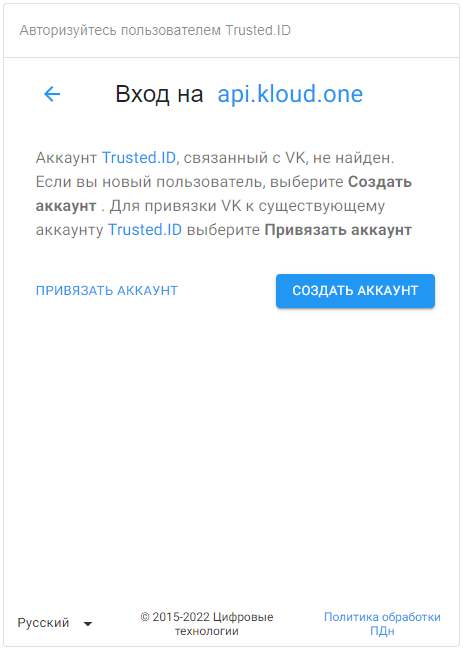

# Инструкция по регистрации в Kloud.One

В обновленной версии платформы Kloud.One стала доступной аутентификация с сервисом Trusted.ID. Это сделано для усиления безопасности и удобства пользователей. Теперь можно использовать **одну учетную запись для всех сервисов** Kloud.One.
Для того, чтобы войти в личный кабинет Kloud.One, необходимо в верхней строке меню выбрать нужное приложение.

После перехода по ссылке открывается виджет авторизации. 

Регистрация возможна напрямую по кнопке **Создать аккаунт** или через **социальные сети**. 

## Регистрация пользователя
Для создания нового пользователя необходимо в виджете авторизации нажать на **Создать аккаунт**.
Открывается окно создания аккаунта. 

В форме представлены следующие обязательные поля:

· **Укажите ваше имя** - имя, по которому сервис будет обращаться к пользователю.  
· **Придумайте логин** - логин должен быть уникальным для сервиса, в дальнейшем с его помощью можно проходить авторизацию. Логин пользователя может включать латинские буквы (a-z), цифры (0-9) и точку (.), без подчеркивания, минимум 3 символа, максимум 30 . Это может быть одно слово, или слова, разделенные точкой.  
· **Дата рождения** - минимальным возрастом для управления аккаунтом считается 14 лет. Можно ввести дату с клавиатуры или воспользоваться календарем.  
· **Пароль и его подтверждение** - минимальное количество символов 8, максимальное 32.  
· **Согласие на обработку персональных данных** - установка флажка дает согласие на обработку. Для ознакомления с политикой обработки персональных данных на сервисе нужно кликнуть мышью на выделенную цветом часть надписи. После заполнения всех полей становится активна кнопка **Далее**. В настройках приложения стоит обязательность наличия email. При нажатии на кнопку **Далее** открывается 2-я форма виджета регистрации для добавления требуемого идентификатора.  

После введения email происходит проверка на уникальность данного идентификатора с помощью письма с проверочным кодом. Если эти данные используются в сервисе для другого пользователя, то появится информационное сообщение **Идентификатор занят**.  

Если идентификатор будет успешно подтвержден, откроется окно с сообщением о добавлении почтового ящика. 

После успешной регистрации происходит вход в Личный кабинет пользователя без повторной авторизации. 
 

## Регистрация пользователя через социальные сети
В форме авторизации необходимо выбрать социальную сеть для авторизации.

Когда аккаунт в социальной сети не прикреплён ни к одному из профилей, открывается форма выбора действия, в которой можно **Привязать аккаунт**, или создать аккаунт по кнопке **Создать аккаунт**.  

После перехода на виджет регистрации, нужно пройти регистрацию, описанную в разделе **Регистрация пользователя**.

