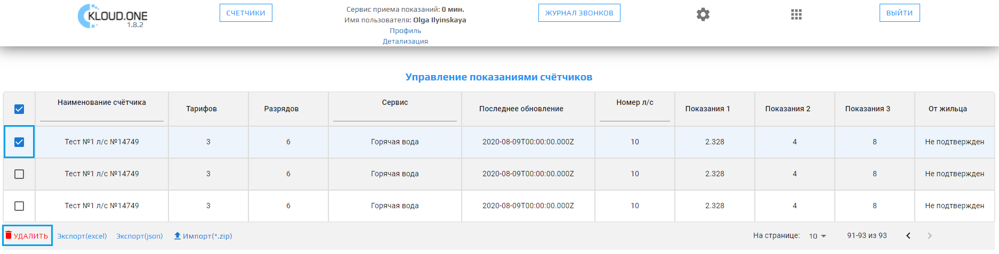
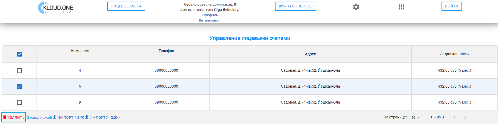

 !!! Во Во всех таблицах приложений Kloud.One данные можно удалить, выбрав флажок слева и нажав кнопку **Удалить**

 ## ППС: Удаление данных из таблицы Управление показаниями счётчиков

Если флажок слева неактивирован, кнопки **Удалить** внизу нет.

Чтобы удалить данные по определенному счётчику, нажмите на флажок слева от счетчика и нажмите на кнопку **Удалить**.

## ОД: Удаление данных из таблицы Управление лицевыми счетами

Чтобы удалить данные по определенному лицевому счетчику, нажмите на флажок слева от лицевого счета и нажмите на кнопку **Удалить**.

