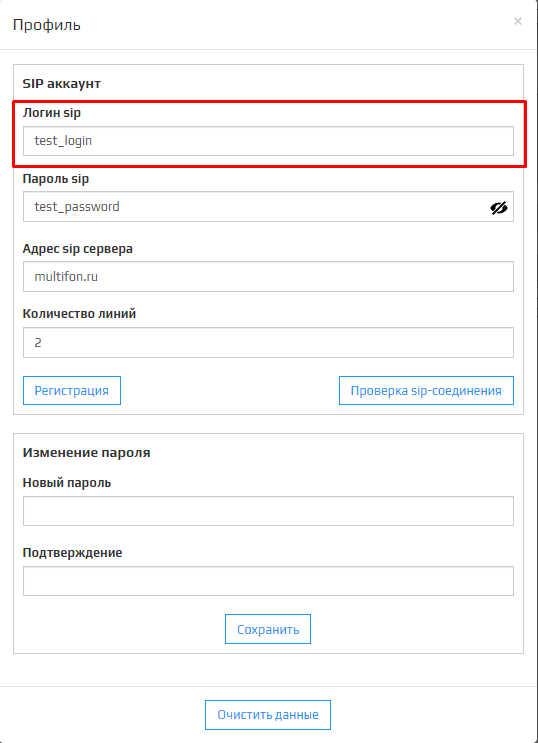
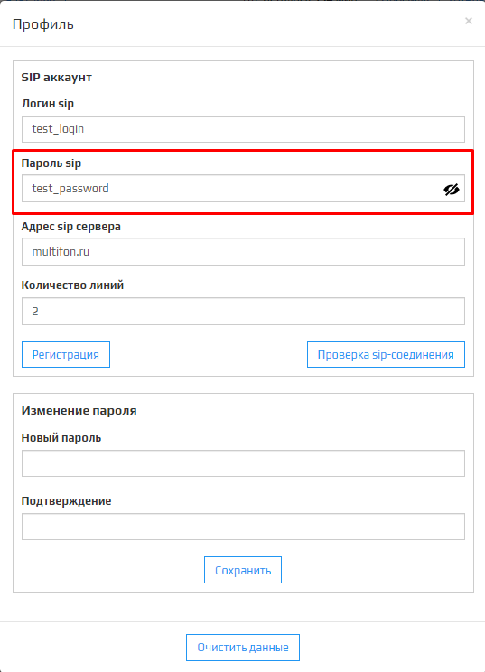
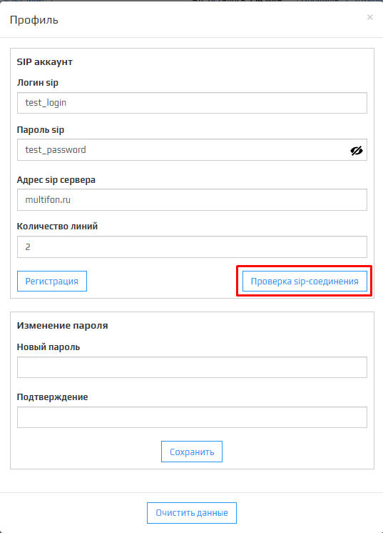

Раздел **Профиль** представляет собой модальное окно, в котором происходит **Смена настроек sip подключения**, **Изменение количества линий**, **Регистрация изменений sip аккаунта**, **Проверка sip-соединения**, **Изменение пароля** и **Очистка базы данных**  клиента.

## Логин Sip:

В этом поле указывается логин sip-подключения.  
🛈 Для Мультфона логин это номер телефона.  
🛈 Для завершения смены логина Sip нажмите на кнопку **Регистрация**.

## Пароль Sip:

В этом поле указывается пароль sip-подключения.  
🛈 Для завершения смены пароля sip нажмите на кнопку **Регистрация**.

## Адрес Sip сервера:

В этом поле указывается адрес сервера sip-подключения.  
🛈 Для Мультфона это **multifon.ru**.  
🛈 Для завершения смены адреса sip нажмите на кнопку **Регистрация**.

## Количество линий:

В этом поле указывается количетсво линий sip-подключения.  
🛈 Не рекомендуется ставить количество линий больше имеющихся у вас линий IP-телефонии, так как это приведёт к ошибкам в звонках, связанным с нехваткой линий.  
🛈 Для завершения смены количества линий нажмите на кнопку **Регистрация**.

## Регистрация:

Кнопка Регистрации сохраняет изменения связанные с SIP аккаунтом.  
🛈 Сохраняет изменения **Логин sip**, **Пароль sip**, **Адрес sip сервера** и **Количество линий**.  
🛈 После нажатия на кнопку появится модальное окно оповещающее об успешном обновлении профиля, для продолжения нажмите **ОК**.

## Проверка sip-соединения:

Кнопка **Проверки sip-соединения** отображает в сплывающем окне статус sip-соедиения относительно правильности введенных данных в **SIP аккаунт**. Так же отображает в какое время была запущена проверка.  
* Статус **зарегистрирован** ознаечает, что все данные SIP аккаунта введены верно и он готов к работе сервиса.
* Статус **незарегистрирован** ознаечает, что какие то данные SIP аккаунта введены неверно и вам следует внимательнее их проверить.
* Статус **Ошибка! Обратитесь в техподдержку** ознаечает, что у сервиса возникли проблемы и вам следует обратится в техподдержку, для решения этого вопроса. 
  

## Новый пароль:

Поле для ввода нового пароля.

## Подтверждение:

Поле дублирует поле **Новый пароль** для подтверждения нового пароля. Для завершения смены пароля нажмите на кнопку **Сохранить**.  
После успешной смены пароля откроется модальное окно **Профиль успешно обновлен**, нажмите **ОК** для закрытия модального окна.

## Кнопка Сохранить

Сохраняет новый пароль, если поля **Новый пароль** и **Пдтверждение** совпадают.

## Кнопка Очистить данные

Кнопка **Очистить данные**, позволяет удалить все данные по лицевым счетам и счётчикам из базы клиента.  
🛈 После нажатия на кнопку **Очистить данные** появится модальное окно с вопросом подтверждения удаления. Для продолжения удаления нажмите **ОК**, для отмены **Отмена**.

