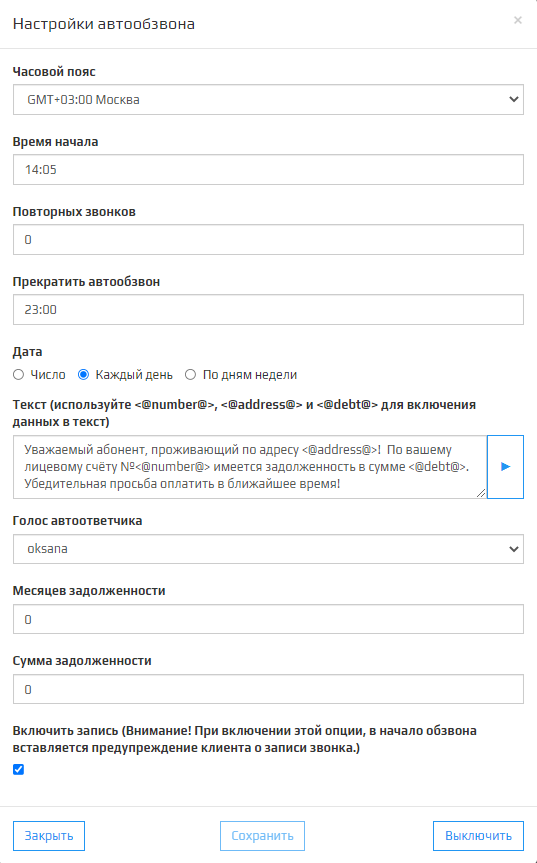
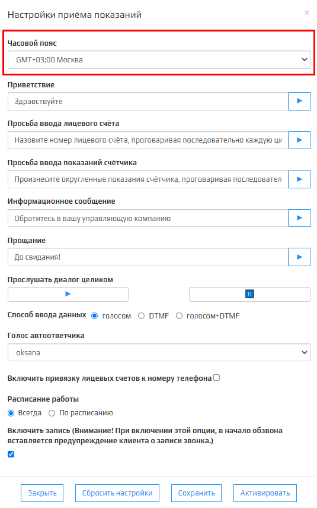
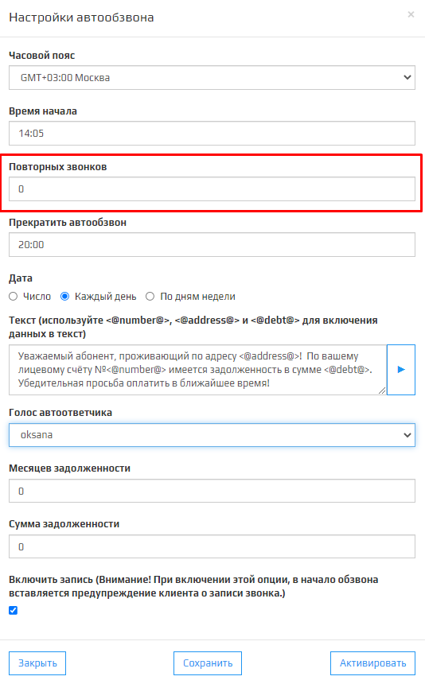
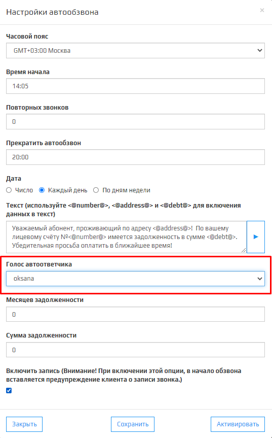
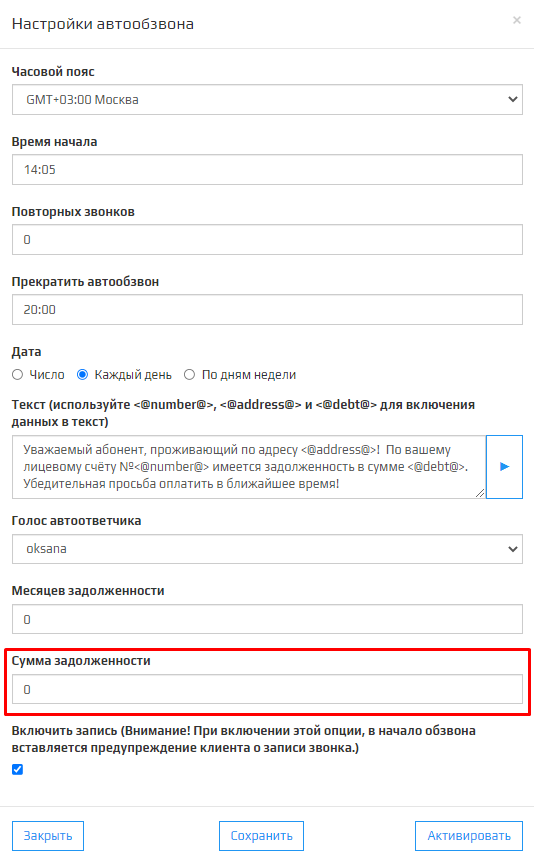

**Автообзвон должников** или **АД** является одним из модулей платформы Kloud.One, отвечающий за напоминание абонентам о внесении платы.

### Поле Часовой пояс

Поле Часовой пояс отвечает за время начала автообзвона должников. При изменении часового пояса, время начала автообзвона ставится по тому часовому поясу, который выбран в настройках.  
🛈 Параметр связан с **временем начала** автообзвона в модуле **АД**.  
🛈 После изменения этого параметра рекомендуем ненадолго ~1 минута включить и выключить модуль АД.  
🛈 После регистрации нового клиента этот параметр по умолчанию равен **GMT+03.00 Москва**.

### Поле Время Начала

В этом поле указывается время начала автообзвона в 24-часовом формате.  
Например: 15:45.  
🛈 Если вы желаете поставить задачу на **Автообзвон должников**, в работу прямо сейчас, рекомендуется прибавить к текущему времени ~5 минут. Это необходимо, чтобы сервис обработал все выбранные настройки и подготовил всё необходимое для обзвона.  
🛈 Если ваша задача запланирована, то никаких минут прибавлять не нужно.

### Поле Повторных звонков

В этом поле указывается количество повторных звонков, если клиент по какой то причине его не принял.

### Поле Прекратить автообзвон

В этом полем указывается время конца автообзвона в 24-часовом формате.  
Например: 15:45.  
🛈 Параметр связан с **Временем начала**, так как прекратить обзвон должников раньше, чем он начнётся нельзя.

### Переключатель Дата

В этом поле имеется возможность выбрать один из трех возможных состояний:  **Число**, **Каждый день**, **По дням неделя**.  

При выборе состояния **Число**, появляется поле для ввода даты. При нажатии на это поле, откроется модальное окно в виде календаря.  
🛈 После выбора нужной даты на обзвон число записывается в формате **ДД.ММ.ГГ.**  

При выборе **Каждый день** автообзвон будет запускаться ежедневно согласно полям **Время начала** и **Прекратить автообзвон**.

При выборе  **По дням недели**, появляется список для выбора дней с флажком.  
При выборе этого состояния, автообзвон будет запускаться каждую неделю с выбранными днями, согласно полям **Время начала** и **Прекратить автообзвон**.

### Текст

В этом поле указывает сообщение, которое будет синтезироваться голосом автоответчика для абонента.  
🛈 Имеется кнопка, чтобы прослушать как будет звучать сообщение учитывая выбранный **Голос автоответчика**.

Присутствуют команды <@number@>, <@address@> и <@debt@>:  
* **<@number@>** при использовании данной команды в поле **Текст** будет произносится **Номер лицевого  счета** из таблицы **Управление лицевыми счетами**.  
* **<@address@>**  при использовании данной команды в поле **Текст** будет произносится **Адрес** из таблицы **Управление лицевыми счетами**.  
* **<@debt@>** при использовании данной команды в поле **Текст** будет произносится **Задолженность** из таблицы **Управление лицевыми счетами**.

### Выпадающий список Голос Автоответчика

В модуле АД имеется 5 голосов для автоответчика:  **Jane**, **Oksana**, **Omazh**, **Zahar**, **Ermil**.  
Голоса отличаются по полу, тембру и скорость произнесения речи.  
🛈 По умолчанию стоит голос **oksana**. 

### Месяцев задолженности

В этом поле указывается  количество месяцев задолженности в формате <**число**>.  
Например:  **4**, **6**, **27**.  
🛈 От этого параметра зависит список абонентов на автообзвон.

### Сумма задолженности

В этом поле указывается сумма задолженности( в руб.) в формате: <**число**>.  
Например:  **450**.  
🛈 От этого параметра зависит список абонентов на автообзвон.

### Включить запись

При включении флажка, при автообзвоне должников, автоответчик будет записывать разговор с момента поднятия трубки абонента и до сброса трубки роботом/абонентом. Также можно прослушать записи звонка в **Журнале звонков**.  
🛈 При включенном флажке будет произнесена фраза: "Внимание для улучшения работы сервиса разговор может быть записан".  

### Кнопка Закрыть

При нажатии на кнопку **Закрыть**  модальное окно **Настройки автообзвона** закрывается.

### Кнопка Сохранить

При нажатии на кнопку **Сохранить** настройки автообзвона обновляются на новые.  
🛈 Тусклая кнопка означает что, изменений в настройках не было.  
🛈 После изменении параметров в настройках, модальное окно повторно открывается. 

### Кнопка Активировать

При нажатии на кнопку **Активировать**, автообзвон должников запускается используя параметры **Часовой пояс**, **Время начала**, **Повторных звонков**, **Прекратить автообзвон**, **Дата**, **Голос автоответчика**, **Месяцев задолженности**, **Сумма задолженности** и **Включить запись**.  
🛈 При нулевой задолженности абонента и настройках **Сумма задолженности**, абонент попадет в список на автообзвон.  
🛈 При отсутствии данных модуль АД не запустится.  
🛈 При отсутствии абонентов имеющих задолженность появится модальное окно с ошибкой, модуль АД не запустится.

