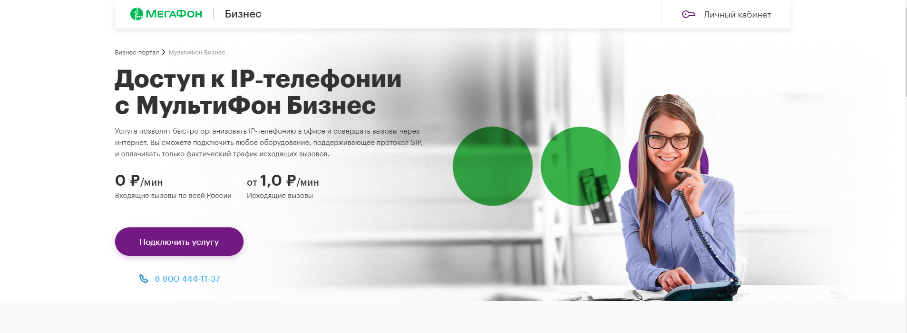
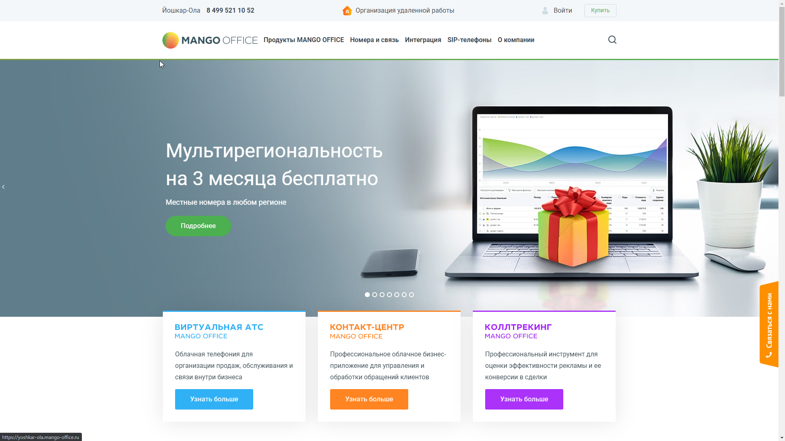

## Описание

**Kloud.one** - современная мультизадачная облачная платформа предназначенная для обработки голосовой информации и тоновых сигналов (DTMF), входящих и исходящих звонков, сбора информации от абонентов и занесение ее в учетные системы.

Платформа состоит из:

1. Веб-Интерфейс ЖКХ
1. Модуль АД
1. Модуль АППС
1. Модуль ПЗ
1. Модуль оповещения
1. Модуль отчетов

Направления работы платформы:

- оптимизацию работы колл-центра;
- улучшение качества клиентского сервиса;
- повышение лояльности клиента;
- получение ответа на часто задаваемые вопросы без использования оператора;
- повышение скорости обработки поступающих обращений и их количества;
- интеграцию с базами данных.

## Назначение и условия применения

### Конфигурация компьютера

Минимальные системные требования:

1. Процессор - Intel Pentium 4 / Athlon 64 или новее
1. Свободное место на диске - 350 Мб
1. Оперативная память - 512 Mб

### Поддерживаемые Браузеры

Google Chrome 85.0 или новее

### Список сторонних компонентов

Мультифон - Мультифон-Бизнес, услуга от Мегафона, которая позволяет организовать телефонную связь через интернет, используя протокол передачи данных - SIP. Подбронее вы можете прочитать по ссылке  (https://multifon.megafon.ru/).

Мы используем Мультифон, как номер телефона, с которого происходят исходящие или  входящие звонки для модулей  АППС и АД.

Mango Office - виртуальная АТС Mango Office, которое использует протокол передачи данных - SIP.  
Подбронее вы можете прочитать по ссылке  (https://www.mango-office.ru/).

Распознавание голоса Яндекс (Yandex.SpeechKit) - технология распознавания голоса от Яндекс, используется для обработки полученных ответов и синтеза речи для абонентов модулей площадки Kloud.One.

Bitrix24 - CRM  от 1С-Битрикс, используется для автоматического оповещения клиентов о низком балансе модулей АППС и АД. Клиент получается письмо в котором содержится, название, текущий баланс модуля и просьбу о пополнении баланса.

Виртуальная АТС от Ростелеком - виртуальная АТС, которое использует протокол передачи данных - SIP, которое мы используем как номер телефона, с которого происходят исходящие или  входящие звонки для модулей  АППС и АД.  
Подробнее вы можете прочитать по ссылке  (https://maryel.rt.ru/b2b/telephony/vats).

Виртуальная АТС от Мегафон -виртуальная АТС, которое использует протокол передачи данных - SIP, которое мы используем как номер телефона, с которого происходят исходящие или  входящие звонки для модулей  АППС и АД.

Подбронее вы можете прочитать по ссылке  (https://vats.megafon.ru/)

1C ЖКХ Рарус - модуль к 1С Учет, которая представляет из себя программу, созданная 1С ЖКХ Рарус для автоматизации предприятий сферы ЖКХ. Служит, как интерфейс для загрузки данных: лицевых счетов, счетчиков и показаний по этим счетчикам.  
Подбронее вы можете прочитать по ссылке  (https://vgkh.ru/jsk/jkh/)