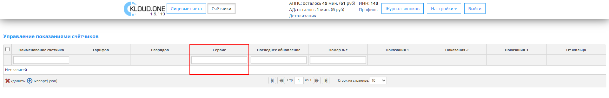

Вкладка **Счетчики** нужна для работы модуля **АППС**, представляет собой таблицу **Управление показаниями счетчиков**, кнопки **Удалить** и **Экспорт**, **Панель навигации** по таблице и настройку **Строк на странице**.

## Управление показаниями счетчиков содержит:

### Наименование счетчика

В этом поле содержится название счетчика, которое мы получаем из системы 1С ЖКХ.


#### Тарифов

В этом поле указывается количество тарифов для определенного счетчика. Всего может быть 3 тарифа: первый отвечает за дневное показание счетчика, второй за ночное показание и третий за пиковое.


### Разрядов

В этом поле указывается количество разрядов для определенного счетчика.

🛈 Это дополнительный параметр, не влияющий на счетчик.  


### Сервис

В этом поле содержится название сервиса, которое мы получаем из системы 1С.  
Например:  **Горячая вода** или **Холодная вода**.



### Последнее обновление

В этом поле указывается дата последнего приема показаний счетчика, если приема показаний не происходило, то ставится дата создания из системы 1С. Дата указывается в формате:


**YYYY-MM-DDTHH:mm:ss.sssZ**, где:

**YYYY-MM-DD** – дата в формате год-месяц-день.  
**T** - разделитель.  
**HH:mm:ss.sss** – время: часы-минуты-секунды-миллисекунды.  
Часть **Z** обозначает временную зону – в формате +-hh:mm, либо символ Z, обозначающий UTC.

🛈 По стандарту её можно не указывать.

Также возможны укороченные варианты, например **YYYY-MM-DD** или **YYYY-MM** или даже только **YYYY**.

### Номер л/с

В этом поле указывается номер лицевого счета,  которое мы получаем из системы 1С. Этот параметр один для вкладки **Лицевые счета**.

🛈 Если лицевой счет будет удален, все счетчики связанные с ним, также удалятся.


### Показания 1

В этом поле указывается дневное показание для определенного счетчика, которое мы получаем из системы 1С.


🛈 Показание записывается в целом формате без запятых и точек.

Например: 117, 2000.

### Показания 2

В этом поле указывается ночное показание для определенного счетчика, которое мы получаем из системы 1С.


🛈 Показание записывается в целом формате без запятых и точек.

Например: 117, 2000.

### Показания 3
В этом поле указывается пиковое показание для определенного счетчика, которое мы получаем из системы 1С.


🛈 Показание записывается в целом формате без запятых и точек.

Например: 117, 2000.

### От жильца

Этом поле указывается откуда данные поступили в платформу Kloud.One. При значении **false** данные получены из 1С или загружены вручную. При значении **true** данные получены от абонента.


🛈 После первого приема показаний статус автоматически меняется на **true**.

## Панель Управления по таблице содержит:

### Удалить

При нажатии кнопки **Удалить** выделенная строка удаляется из таблицы Управление показаниями счетчиков.


Для удаления одной или несколько строк из таблицы, выберите флажок слева от **названия счётчика** и нажмите на кнопку **Удалить**.

### Экспорт (.json)

После нажатия на кнопку **Экспорт (.json)**  данные из таблицы экспортируются в файл **export.json**.

.png "Кнопка Экспорт (.json)")

.png "Скачанный файл export.json")

🛈 Экспортируются все данные, которые находятся в таблице **Управление показаниями счетчиков**.


Содержимое  файла  **export.json**:
```
[
    {
        "acc_id": {
            "id": "5f16fb358d0ddc0fd0ea4d62_0505032"
        },
        "name": "Вода",
        "values": 1,
        "capacity": 6,
        "service": "Холодная вода",
        "date": "2020-09-07T00:00:00.000Z",
        "val1": 0,
        "val2": 0,
        "val3": 0,
        "id": "00000001"
    },
    {
        "acc_id": {
            "id": "5f16fb358d0ddc0fd0ea4d62_0505032"
        },
        "name": "Газ",
        "values": 1,
        "capacity": 6,
        "service": "Газовое снабжение",
        "date": "2020-09-07T00:00:00.000Z",
        "val1": 356,
        "val2": 0,
        "val3": 0,
        "id": "00000002"
    }
]
```

## Панель навигации по таблице содержит:

### Вернуться на первую страницу

После нажатия на кнопку **Вернуться на первую страницу**  откроется 1 страница таблицы.

🛈 Тусклая кнопка означает что вы уже на первой странице или таблица имеет всего 1 страницу.


### Кнопка "Вернуться на предыдущую страницу"

После нажатия на кнопку **Вернуться на предыдущую страницу**  откроется предыдущая страница по счету таблицы.

🛈 Тусклая кнопка означает что вы уже на первой странице или таблица всего имеет 1 страницу.


### Стр.

Поле **Стр.** отображает количество страниц таблицы, этот параметр связан с параметром **Строк на странице**, чем больше строк на странице, тем меньше отображается страниц в таблице.


### Перейти на следующую страницу

После нажатия на кнопку **Перейти на следующую страницу** откроется следующая страница по счету таблицы.

🛈 Тусклая кнопка означает, что открыта последняя страница или таблица всего имеет 1 страницу.


### Перейти на последнюю страницу

После нажатия на кнопку **Перейти на последнюю страницу** откроется последняя страница таблицы.

🛈 Тусклая кнопка означает что вы уже на последней странице или таблица всего имеет 1 страницу.


### Строк на странице и выпадающий список

Настройка **Строк на странице** отображает количество строк в таблице, из выпадающего списка можем выбрать одно из несколько значений: 10, 20, 50, 100, 200.

🛈 Этот параметр связан с **параметром Стр.**, чем больше строк на странице, тем меньше отображается страниц в таблице.

