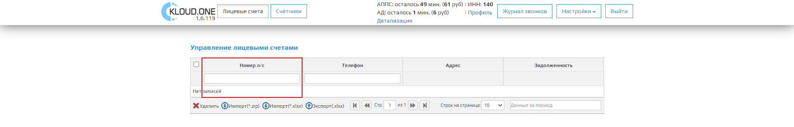
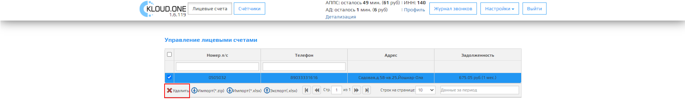
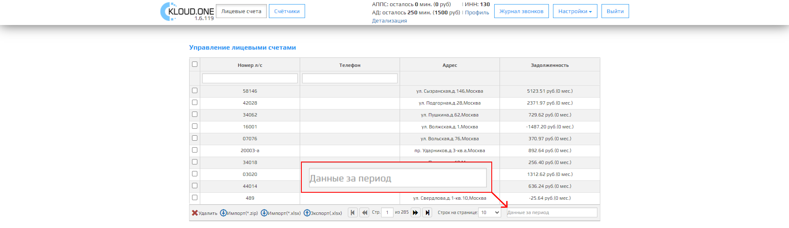

Вкладка **Лицевые счета** нужна для модуля **Автообзвон должников**, для просмотра, импорта и экспорта, а также удаления данных. При нажатии на кнопку **Лицевые счета**  открывается таблица **Управление лицевыми счетами**.

## Таблица Управление лицевыми счетами содержит:

### Номер л/с

В этом поле указывается номер лицевого счета, который мы получаем из системы 1С.

### Телефон

В этом поле указывается телефон, который привязывается к **номеру лицевого счета**. Формат номера телефона начинается с **8**. Например: "80000000000".

🛈 При загрузке базы данных все номера начинающиеся с **7** автоматически меняются на **8**.

### Адрес

В этом поле указывается адрес, который привязывается к **номеру лицевого счета**.  
Формат записи:  **Улица**, **Номер дома**, **Номер квартиры**, **Город**.

🛈 Если поле Город пустое, автоматически заполняется городом **Москва**.

### Задолженность

В этом поле указывается задолженность, который привязывается к **номеру лицевого счета**. Формат записи:  **Число.00 руб** (Срок задолженности в месяцах).  
Например:  **560.05 (3 мес.)**

## Панель Управления по таблице содержит:

### Удалить

При нажатии этой кнопки выделенная строка полностью удалится из базы данных платформы.

🛈 При включенном **Автодозвоне Должников** не рекомендуется удалять лицевые счета, т.к очередь должников формируется в момент запуска модуля.  
🛈 Если вы удалили лицевой счет(а) во время **АД**, перезапустите модуль.

Для удаления одной или несколько строк из таблицы, выберите флажок слева от названия счётчика и нажмите на кнопку **Удалить**.

После удаления одной или несколько строк данные из этих строк(и) удаляются из базы данных платформы.

### Импорт (*.zip)

После нажатия на кнопку **Импорт (*.zip)** откроется стандартная форма открытия файлов Windows. После этого нужно выбрать файл, который нужно импортировать выбираем его и нажимаем **Открыть**.

.png "Кнопка Импорт (*.zip)")

После чего в **Личном кабинете** откроется модальное окно об успешной загрузке файла.  
Нажмите на кнопку **ОК** для подтверждения загрузки.

Кнопка **ОК** в форме для подтверждения загрузки файла.

### Импорт (*.xlsx)

После нажатия на кнопку **Импорт (*.xlsx)** откроется стандартная форма открытия данных.  
После чего нужно выбрать файл, который нужно импортировать выбираем его и нажимаем **Открыть**.

.png "Кнопка Импорт (*.xlsx)")

.png "Стандартная форма открытия файлов Windows")

### Экспорт (.xlsx)

После нажатия на кнопку **Экспорт (.xlsx)** данные из таблицы экспортируются в файл **export.xlsx**, в котором будут все данные из таблицы **Управление лицевыми счетами**.

.png "Кнопка Экспорт (.xlsx)")

Экспортированная  таблица в .xlsx формате:

| id      | number   | city   | street    | house |  apartment  | sum     |    phone    |
| ------- | -------- | ------ | --------- | ----- | ----------- | ------- | ----------- |
| A1111   | 1111     | Москва | Садовая   | 16    | 22          | 0       | 89000000000 |
| 0505032 | 0505032  | Москва | Первая    | 98    | 31          | 675,05  | 89000000000 |
| 5464472 | 5464472  | Москва | Первая    | 78    | 9           | 305     | 89000000000 |

## Панель навигации по таблице содержит:

### Вернуться на первую страницу

После нажатия на кнопку **Вернуться на первую страницу**  откроется 1 страница таблицы.

🛈 Тусклая кнопка означает что вы уже на первой странице или таблица всего имеет 1 страницу.

### Вернуться на предыдущую страницу

После нажатия на кнопку **Вернуться на предыдущую страницу**  откроется предыдущая страница по счету таблицы.

🛈 Тусклая кнопка означает, что вы уже на первой странице или таблица всего имеет 1 страницу.

### Стр.

Параметр **Стр.** отображает количество страниц таблицы, этот параметр связан с **параметром Строк на странице**, чем больше строк на странице, тем меньше страниц в таблице.

### Перейти на следующую страницу

После нажатия на кнопку **Перейти на следующую страницу**  откроется следующая страница по счету таблицы.

🛈 Тусклая кнопка означает, что открыта последняя страница или таблица всего имеет 1 страницу.

### Перейти на последнюю страницу

После нажатия на кнопку **Перейти на последнюю страницу**  откроется последняя страница таблицы.

🛈 Тусклая кнопка означает что вы уже на последней странице или таблица всего имеет 1 страницу.

### Строк на странице

Выпадающий список **Строк на странице** отображает количество строк в таблице, из выпадающего списка можем выбрать одно из несколько значений: 10, 20, 50, 100, 200.

🛈 Этот параметр связан с **параметром Стр.**, чем больше строк на странице, тем меньше отображается страниц в таблице.

### Данные за период

Форма ввода **Данные за период** представляется форму ввода данных в виде календаря. (Не работает)

