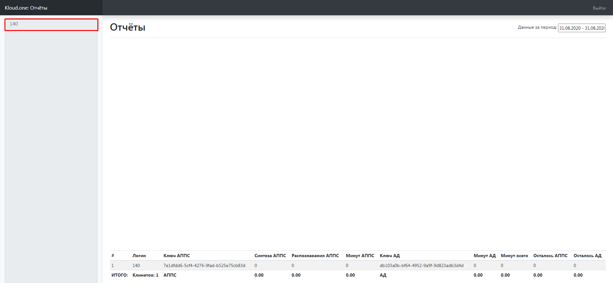

Раздел **Детализация** представляет собой **Отчеты**. Этот раздел содержит следующие элементы:

1. График расходов в месяц;
2. Данные расходов минут на синтез/распознавание речи;
3. Баланс модулей **АППС** и **АД**.

## ИНН клиента

В левом верхнем углу находится ИНН клиента.

## Кнопка Выйти.

В правом верхнем углу находится кнопка **Выйти**.  
После нажатия открывается форма авторизация в **Модуле Отчеты**. (Логин и пароль такие, как и в окне **Авторизация** в **Личном кабинете**).

## Поле Данные за период.

В правом верхнем углу (Ниже кнопки **Выйти**) находится поле **Данные за период**. При нажатии на поле открывается модальное окно в виде календаря для выбора промежутка времени для построения графика.

## График

График располагается по центру страницы, для построения графика необходимо выполнить условие: выбрать период в поле **Данные за период**, за который происходил работа по модулям **АД/АППС** или синтез речи для **АППС**.

## Таблица данных

Таблица отображает данные за период по таким параметрам, как **Логин**, **Ключ АППС**, **Синтез АППС**, **Распознавание АППС**, **Минут АППС**, **Ключ АД**, **Минут АД**, **Минут всего**, **Осталось АППС**, **Осталось АД**.

Поле **Логин** дублирует **ИНН клиента**.  
Поле **Ключ АППС** - идентификатор ключа модуля АППС клиента.  
Поле **Синтеза АППС** - поле в котором, отображается количество минут потрачено на синтез речи по модулю АППС.  
Поле **Распознавания АППС** - поле в котором, отображается количество минут потрачено на распознавание речи по модулю АППС.  
Поле **Минут АППС** - это сумма полей Синтеза АППС и Распознавания АППС.  
Поле **Ключ АД** - идентификатор ключа модуля АД клиента.  
Поле **Минут АД** - поле в котором, отображается количество минут потрачено на синтез речи по модулю АД.  
**Осталось АППС** - поле в котором отображается, текущий баланс по модулю АППС.  
**Осталось АД** - поле в котором отображается, текущий баланс по модулю АД.

