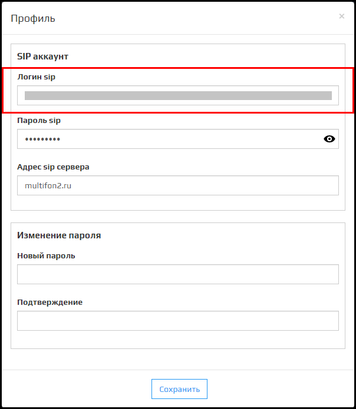
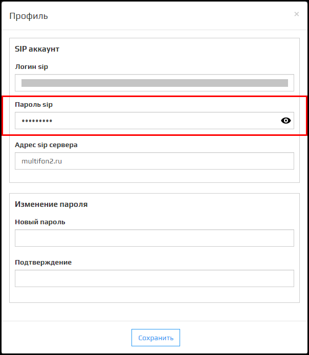

Раздел **Профиль** представляет собой модальное окно, в котором происходит **Смена пароля**, **Смена настроек sip подключения** и **Очистка базы** данных клиента.

## Логин Sip:

В этом поле указывается логин sip-подключения.

🛈 Для Мультфона логин это номер телефона.  
🛈 Для завершения смены логина Sip нажмите на кнопку **Сохранить**.

## Пароль Sip:

В этом поле указывается пароль sip-подключения.

🛈 Для завершения смены логина Sip нажмите на кнопку **Сохранить**.

## Адрес Sip сервера:

В этом поле указывается адрес сервера sip-подключения.

🛈 Для Мультфона это **multifon2.ru**.  
🛈 Для завершения смены логина Sip нажмите на кнопку **Сохранить**.

## Новый пароль:

Поле для ввода нового пароля.

## Подтверждение:

Поле дублирует поле **Новый пароль** для подтверждения нового пароля.

🛈 Для завершения смены пароля нажмите на кнопку **Сохранить**.

После успешной смены пароля откроется модальное окно **Подтвердите действие на странице**, нажмите **ОК** для закрытия модального окна.

