Вкладка **Журнал Звонков** представляет собой таблицу **Журнала Звонков**, в которой отображаются данные о звонках, статусы звонков, записи звонков и файлы с записями звонков, кнопки **Экспорт**, **Экспорт кеша**, **Удалить номер из кэша**, **Панель навигации** по таблице и поле **Данные за период**.

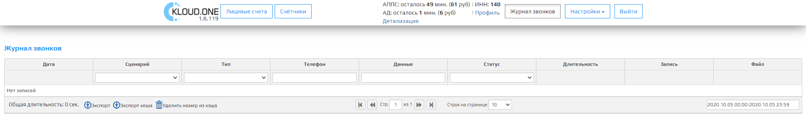

### Дата

В поле указывает дата и время звонка в формате **ДД.ММ.ГГГГ**, **ЧЧ.ММ.СС**. При нажатии надпись **Дата** включается сортировка.

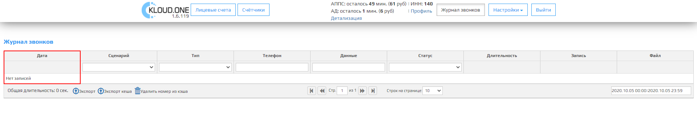

### Сценарий

В поле указывается модули которые имеются у клиента. При нажатии надпись **Сценарий** включается сортировка. Имеется дополнительный выпадающий список со всеми модулями которые имеются у клиента, для поиска или сортировки.

🛈 При выборе одного из пунктов в выпадающем списке, при экспорте данные будут содержать только выбранный пункт из выпадающего списка.  
🛈 При выборе двух или трех одновременно пунктов из выпадающих списков, при экспорте данные будут содержать все три выбранных пунктов из выпадающих списков.

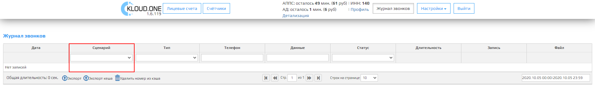

### Тип

В поле указывается тип звонка - **все**, **исходящие** и **входящие**. При нажатии надпись **Тип** включается сортировка. Имеется дополнительный выпадающий список со всеми типами звонков (Все, исходящие, входящие) , для поиска или сортировки.

🛈 При выборе одного из пунктов в выпадающем списке, при экспорте данные будут содержать только выбранный пункт из выпадающего списка.  
🛈 При выборе двух или трех одновременно пунктов из выпадающих списков, при экспорте данные будут содержать все три выбранных пунктов из выпадающих списков

### Телефон

В поле указывается номер телефона с которого звонили (Для АППС) в формате **7xxxxxxxxxx** или на который звонили (Для АД) в формате **8xxxxxxxxxx**.

🛈 При нажатии надпись **Телефон** включается сортировка. Имеется дополнительное поле для поиска конкретного номера телефона.

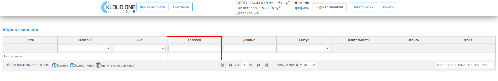

### Данные

В поле указывается данные, которые мы получаем из звонка.

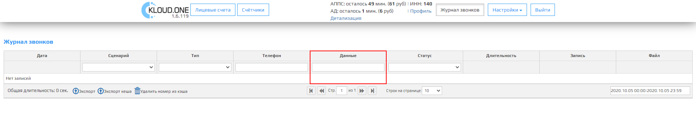

### АППС:

номер лицевого счета: <л/с>;  
счетчик n: <показание>;  
счетчик n+1: <показание>; (если 2-ух и более тарифный счетчик )  
счетчик n+2: <показание>. (если 3-ый тарифный счетчик )  

### АД:

№ Л/С <лицевой счет>

🛈 При нажатии надпись **Данные** включается сортировка. Имеется дополнительное поле для поиска конкретного номера лицевого счета/показания счетчика.

### Статус

В поле указывается один из статусов звонков (Все,отвечен,отменен,ошибка, запуск).

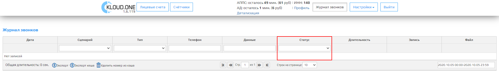

Статус **Отвечен** присваивается, когда абонент поднял трубку.

Статус **Отменен** присваивается  в следующих ситуациях:  

1. Когда баланс модулей АД и АППС равен 0.
2. Когда мы не могли дозвониться до абонента (Абонент не взял трубку).

Статус **Ошибка** присваивается  в следующих ситуациях:

1. Номер телефона на который звонили не существует или номер записан в неправильном формате.
2. Номер телефона на который звонили временно недоступен (Нет связи, включен режим **В самолете**, уже разговаривает с кем-то).

Статус **Запуск (ожидание ответа на звонок)** - присваивается, когда человек уже поднял трубку от нашего сервиса.

🛈 При выборе одного из пунктов в выпадающем списке, при экспорте данные будут содержать только выбранный пункт из выпадающего списка.  
🛈 При выборе двух или трех одновременно пунктов из выпадающих списков, при экспорте данные будут содержать все три выбранных пунктов из выпадающих списков.

### Длительность

В поле указывается длина звонка в секундах.

🛈 Данные могут отличаться +-1 сек.

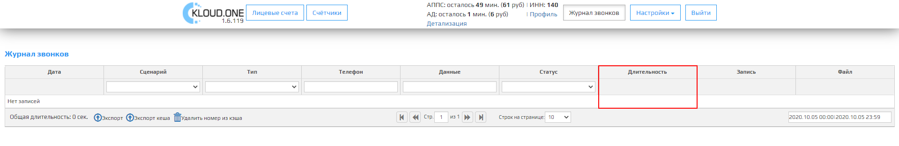

### Запись

В этом поле находится проигрыватель записи звонка. В его функции входит:
- Включение/выключение проигрывание записи.
- Пауза/Продолжить.
- Перемотка по временной шкале.
- Увеличение/Уменьшение громкости.
- Заглушить запись.
- Скачать запись в формате *wav.

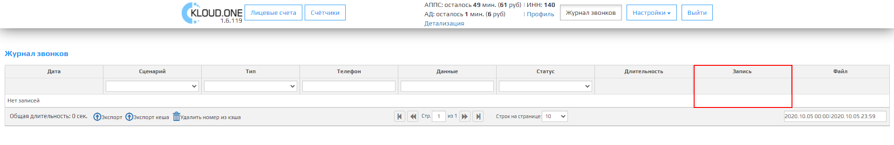

### Файл

В этом поле находится кнопка **Скачать** , при нажатии на эту кнопку скачается запись звонка в формате *wav.

### Экспорт

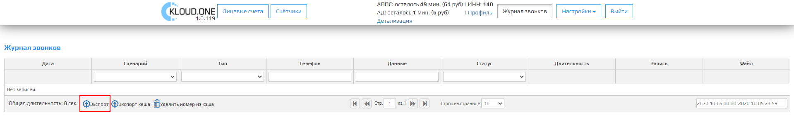

После нажатия на кнопку **Экспорт** данные из таблицы экспортируются в файл **ключ модуля.csv**, в котором будут все данные из таблицы.

🛈 При выборе одного из пунктов в выпадающем списке, при экспорте данные будут содержать только выбранный пункт из выпадающего списка.  
🛈 При выборе двух или трех одновременно пунктов из выпадающих списков, при экспорте данные будут содержать все три выбранных пунктов из выпадающих списков.

Формат экспортируемый таблицы:

| Дата, время            | Телефон     | Сценарий             | Статус    | Данные           | Длительность  | 
| ---------------------- | ----------- | -------------------- | --------- | ------           | ------------- |
| 01.01.2020, 10:10:10   | 89000000000 | автообзвон должников | исходящие | № Л/С 777777     | 22 сек        |

### Экспорт кеша

После нажатия на кнопку **Экспорт кеша**  данные экспортируются в файл **ключ модуля.csv**, в котором будут все данные о **привязанных лицевых счетов к номеру телефона**.

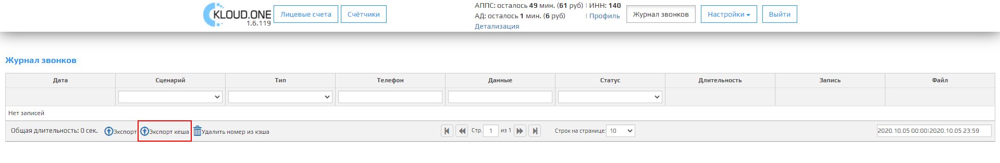

| **Номер телефона** | **Лицевой счет** |
| ------------------ | ---------------- |
| 80000000000        | 0000000123       |
| 80000000000        | 0000000111       |

### Удалить номер из кэша

После нажатия на кнопку **Удалить номер из кэша** откроется модальное окно **Удалить номер из кэша** с полем для ввода **Номер телефона**. После ввода номера телефона и нажатии на кнопку **Удалить** , данный номер телефон удалится из базы привязанных лицевых счетов.

🛈 Привязанный номер 8 999 000 00 00 и 7 999 000 00 00 записываются как два отдельных.  
🛈 Для АППС и АД один и тот же номер привязывается по разному (Для АД начиная с **8**, для АППС начиная с **7**).

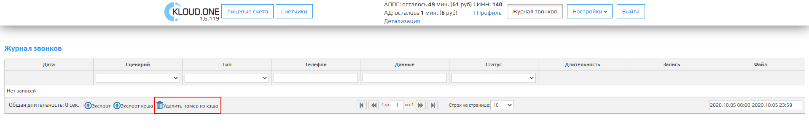

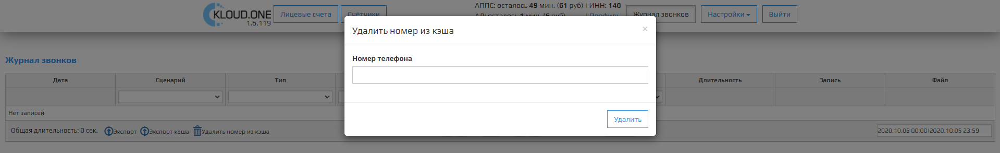

## Панель Управления по таблице содержит:

### Вернуться на первую страницу

После нажатия на кнопку **Вернуться на первую страницу** откроется 1 страница таблицы.

🛈 Тусклая кнопка означает что вы уже на первой странице или таблица всего имеет 1 страницу.

### Вернуться на предыдущую страницу

После нажатия на кнопку **Вернуться на предыдущую страницу** откроется предыдущая страница по счету таблицы.

🛈 Тусклая кнопка означает, что вы уже на первой странице или таблица всего имеет 1 страницу.

### Стр.

Поле **Стр.** отображает количество страниц таблицы, этот параметр связан с **параметром Строк на странице**, чем больше строк на странице, тем меньше страниц в таблице.

### Перейти на следующую страницу

После нажатия на кнопку **Перейти на следующую страницу** откроется следующая страница по счету таблицы.

🛈 Тусклая кнопка означает, что открыта последняя страница или таблица всего имеет 1 страницу.

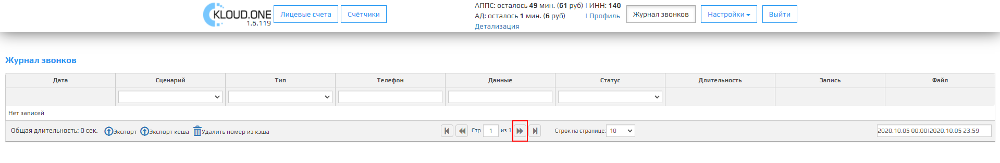

### Перейти на последнюю страницу

После нажатия на кнопку **Перейти на последнюю страницу** откроется последняя страница таблицы.

🛈 Тусклая кнопка означает что вы уже на последней странице или таблица всего имеет 1 страницу.

### Строк на странице

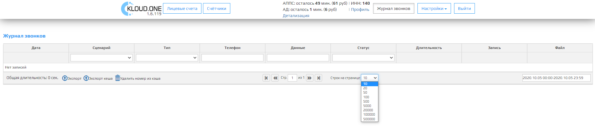

Поле **Строк на странице** отображает количество строк в таблице, из выпадающего списка можем выбрать одно из несколько значений: 10, 20, 50, 100, 200, 500, 5000, 20000, 1000000, 5000000.

 🛈 Это поле связано с **полем Стр.**, чем больше строк на странице, тем меньше страниц в таблице.