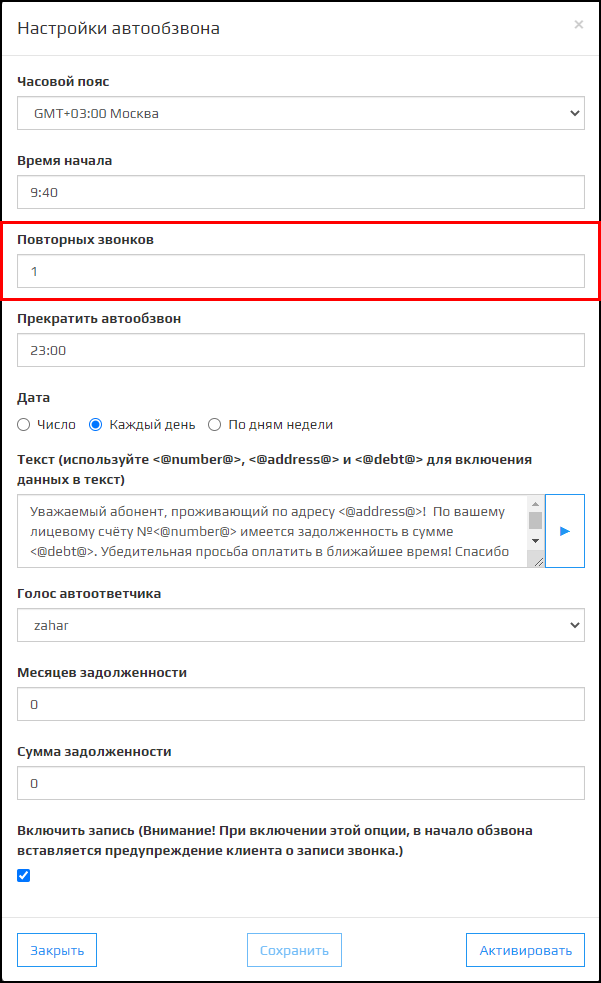
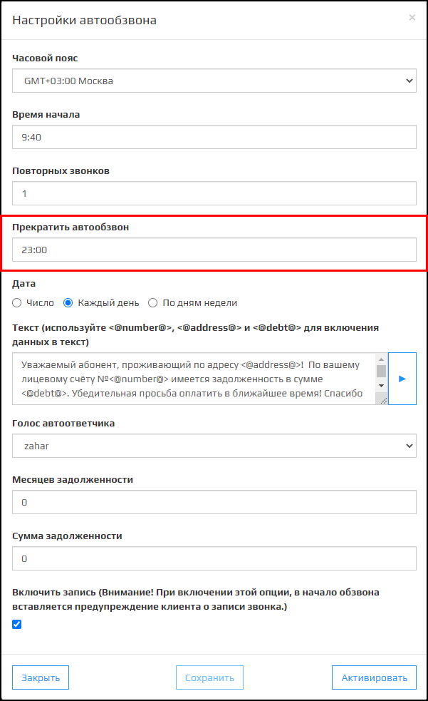
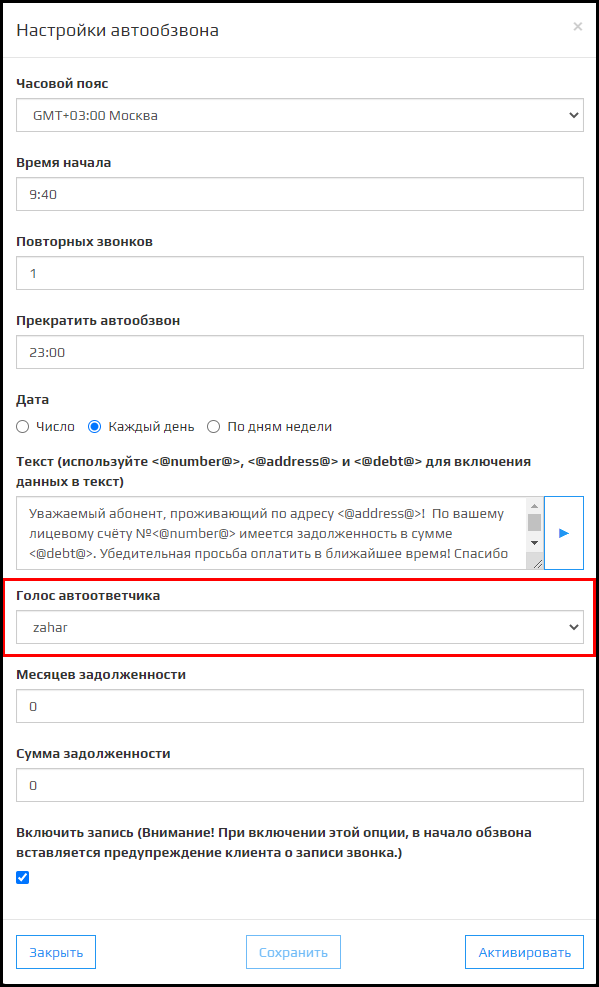
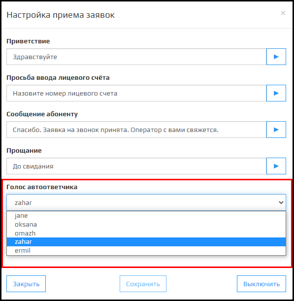
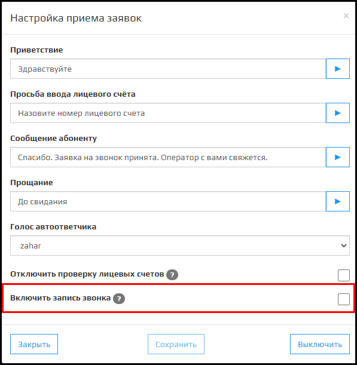
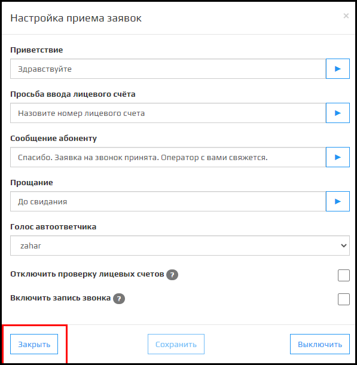

**Автообзвон должников** или **АД**- один из модулей платформы Kloud.One, отвечающий за напоминание абонентам о внесении платы.

### Поле Часовой пояс

Поле Часовой пояс отвечает за время начала автообзвона должников, изменении часового пояса, время ставится по тому часовому поясу, который выбран в настройках. 

🛈 Параметр связан с временем начала автообзвона в модуле **АД**.  
🛈 После изменения этого параметра рекомендуем ненадолго ~1 минута включить и выключить модуль АД.  
🛈 После регистрации нового клиента этот параметр по умолчанию равен **GMT+03.00 Москва**.

### Поле Время Начала

В этом полем указывается время начала автообзвона в 24-часовом формате.  
Например: 15:45.

🛈 По умолчанию время **GMT+3 Москва.**

### Поле Повторных звонков

В этом полем указывается количество повторных звонков.

### Поле Прекратить автообзвон

В этом полем указывается время конца автообзвона в 24-часовом формате.  
Например: 15:45.

🛈 По умолчанию время **GMT+3 Москва.**

### Переключатель Дата

Имеет три состояния:  **Число**, **Каждый день**, **По дням неделя**:  
При выборе **Число**, появляется поле для ввода даты. При нажатии на поле для откроется модальное окно в виде календаря.

🛈 Число записывается в формате **ДД.ММ.ГГ.**

При выборе **Каждый день** автообзвон будет запускаться ежедневно согласно полям **Время начала** и **Прекратить автообзвон**.

При выборе  **По дням недели**, появляется список дней недели с флажком.

### Текст

В этом поле указывает сообщение, которое будет синтезироваться голосом автоответчика для абонента.

🛈 Имеется кнопка, чтобы прослушать как будет звучать сообщение учитывая выбранный **Голос автоответчика**.

Присутствуют команды <@number@>, <@address@> и <@debt@>:  
<@number@> при использовании данной команды в поле **Текст** будет произносится **Номер лицевого  счета** из таблицы **Управление лицевыми счетами**.  
<@address@>  при использовании данной команды в поле **Текст** будет произносится **Адрес** из таблицы **Управление лицевыми счетами**.  
<@debt@> при использовании данной команды в поле **Текст** будет произносится **Задолженность** из таблицы **Управление лицевыми счетами**.

### Выпадающий список Голос Автоответчик

В модуле АД имеется 5 голосов для автоответчика:  **Jane**, **Oksana**, **Omazh**, **Zahar**, **Ermil**. **Голоса** отличаются по полу, тембру и скорость произнесения речи.

🛈 По умолчанию стоит голос **Zahar**.  
🛈 При изменении Голоса автоответчика, голос также изменится для модуля АППС (Если он подключен).

### Месяцев задолженности

В этом поле указывается  количество месяцев задолженности в формате <**число**>.  

Например:  **4**, **6**, **27**.

🛈 От этого параметра зависит список абонентов на автообзвон.

### Сумма задолженности

В этом поле указывается сумма задолженности( в руб.) в формате: <**число.дробная часть**>.  

Например:  **450.00**.

🛈 От этого параметра зависит список абонентов на автообзвон.

### Включить запись

При включении флажка, при автообзвоне должников будет записывать разговор с момента поднятия трубки абонента, также можно прослушать записи звонка в **Журнале звонка**.

🛈 При включенном флажке записывает с момента поднятия трубки абонента и до сброса трубки роботом/абонентом.  
🛈 При включенном флажке будет произнесена фраза: "Внимание для улучшения работы сервиса разговор может быть записан".  

### Кнопка Закрыть

При нажатии на кнопку **Закрыть**  модальное окно **Настройки автообзвона** закрывается.

### Кнопка Сохранить

При нажатии на кнопку **Сохранить** настройки автообзвона обновляются на новые.

🛈 Тусклая кнопка означает что, изменений в настройках не было.  
🛈 После изменении параметров в настройках, модальное окно повторно открывается.  

### Кнопка Активировать

При нажатии на кнопку **Активировать**, автообзвон должников запускается согласно с параметрами **Время начала**, **Прекратить автообзвон** и **Дата**.

🛈 При нулевой задолженности абонента и настройках **Сумма задолженности**, абонент попадет в список на автообзвон.  
🛈 При отсутствии данных модуль АД не запустится.  
🛈 При отсутствии абонентов имеющих задолженность (Ошибка **debt**), как в полях **Месяцев задолженности** и **Сумма задолженности**  модуль АД не запустится.

