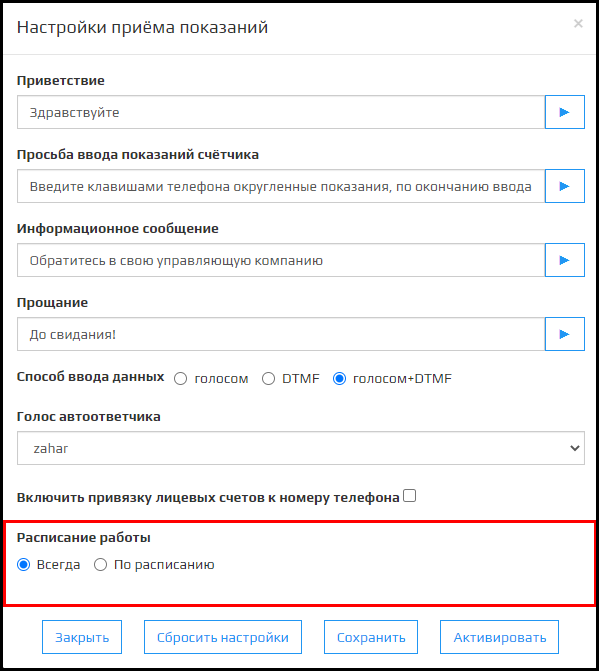

Прием показаний - модуль платформы Kloud.One, отвечающий за автоматическое обновление данных показаний счетчиков выгруженных из 1С.

### Приветствие

В этом полем указывается фраза с которой начинается диалог с абонентом.

🛈 Имеется кнопка , чтобы прослушать как будет звучать сообщение учитывая выбранный **Голос автоответчика**.

Например: "Здравствуйте, вы позвонили в ООО Газпром".

### Просьба ввода лицевого счёта

В этом полем указывается фраза ввода лицевого счета, эта фраза зависит от параметров **Способа ввода данных** и **Голос автоответчика**. 

🛈 Имеется кнопка, чтобы прослушать как будет звучать сообщение учитывая выбранный **Голос автоответчика**.

🛈 После сохранения изменении фразы, она также изменится в диалоге с абонентом.  
🛈 Фраза автоматически изменяется после сохранения изменении **Способа ввода данных**.  
🛈 Поле автоматически пропадает при изменении **Способа ввода данных** на **Голосом+DTMF**.  

### Просьба ввода показаний счетчика

В этом полем указывается фраза ввода показаний счетчика, эта фраза зависит от **Способа ввода данных**.

🛈 Имеется кнопка , чтобы прослушать как будет звучать сообщение учитывая выбранный **Голос автоответчика**.

🛈 При изменении фразы, она также изменится в диалоге с абонентом.  
🛈 Фраза автоматически изменяется при изменении **Способа ввода данных**.  
🛈 При выборе способа ввода **Голос+DTMF** фраза не изменяется в диалоге с абонентом.

### Информационное сообщение

В этом полем указывается фраза ифнормационного сообщения.

🛈 Имеется кнопка , чтобы прослушать как будет звучать сообщение учитывая выбранный **Голос автоответчика**.

Информационное сообщение появляется при:
1.  Если система не распознала номер лицевого счета. 
2.  Отсутствия данных от абонентов (Тишина). 
3.  Вводе лицевого счета, которого нет в базе данных площадки Kloud.One. 
4.  Вводе лицевого счета, по которому нет приборов учета в базе данных площадки Kloud.One.

### Прощание

В этом полем указывается фраза перед завершением звонка.

🛈 Имеется кнопка, чтобы прослушать как будет звучать сообщение учитывая выбранный **Голос автоответчика**.

### Прослушать диалог целиком

Поле представляет собой две кнопки **Проиграть запись** и **Пауза**. Проигрывается запись идеального прохождения сценария **Приема показаний счетчика**. В сценарии происходит прием показаний по одному счетчику, способ ввода - голосом.

🛈 Фразы в сценарии являются динамическими (В зависимости от того, что написано в полях **Приветствие**, **Просьба ввода лицевого счёта**, **Просьба ввода показаний счетчика**, **Информационное сообщение** и **Прощание**).

### Способ ввода данных

Переключатель отвечает за то, как абонент будет вводить данные.

🛈 При стандартных настройках это **Голос**.  
🛈 Для каждого способа ввода есть свой сценарий приема показаний.

Состоит из трех вариантов:  **Голосом**, **DTMF** и **голосом+DTMF**.  
При выборе **Голосом**, данные получаем из распознанных фраз абонента. ( Поля **Просьба ввода лицевого счёта** и  **Просьба ввода показаний счётчика** изменяются при смене с DTMF).  
При выборе **DTMF**, данные получаем из ввода клавиш телефона абонента ( Поля **Просьба ввода лицевого счёта** и  **Просьба ввода показаний счётчика** изменяются при смене с Голосом).

При выборе **Голосом+DTMF** (Поля **Просьба ввода лицевого счёта** и  **Просьба ввода показаний счётчика** перестают быть динамическими, изменения в полях не будут влиять на фразы, которые услышит абонент), перед началом приема показаний абонент услышит фразу: "Для того чтобы ввести показанием голосом скажите "Да", чтобы ввести показания DTMF нажмите на клавишу 1".  
Если абонент скажет "Да", тогда сценарий приема показаний изменится на при выборе способа ввода данных - **Голосом**.  
Если абонент скажет "Нет" или нажмет клавишу телефона "1", тогда сценарий приема показаний изменится, как при выборе способа ввода данных - **DTMF**.

### Выпадающий список Голос автоответчика

В модуле **Прием Показаний** имеется 5 голосов для автоответчика:  **Jane**, **Oksana**, **Omazh**, **Zahar**, **Ermil**. Голоса отличаются по полу, тембру и скорость произнесения речи.

🛈 По умолчанию стоит голос **Zahar**.  
🛈 При изменении Голоса автоответчика, голос также изменится для модуля АД (Если он подключен).  

### Включить привязку лицевых счетов к номеру телефона

Этот флажок отвечает за привязку лицевого счета к номеру телефона. После первого приема показаний, при включенном флажке, этот номер сохраняется в БД с привязкой лицевого счета.

При следующем прием показаний после приветствия абонента услышит фразу: "Для того, чтобы оставить показания по лицевому счету **номер л/c**  скажите/нажмите **n**. Для ввода нового лицевого счёта скажите 0".  
Если абонент скажет/нажмет **n**, то он перейдет на Просьбу ввода показаний, пропуская ввод лицевого счета.  
Если абонент скажет/нажмет **0**, то он перейдет на Просьбу ввода лицевого счета (Как при выключенном флажке **Включить привязку лицевых счетов к номеру телефона**).

🛈 Если абонент имеет несколько привязанных лицевых счетов, после приема показаний, он услышит фразу: "Для того, чтобы оставить показания по лицевому счету **номер л/c** (Произносятся л/c, привязанные к номеру телефона и по которым ещё не было приема показания) скажите/нажмите **n**. Для завершения скажите/нажмите **нет**.

### Расписание работы

Представляет собой два переключателя:  **Всегда** и **По расписанию**.

При выборе **Всегда**, Приём показаний будет активен до тех пор, пока модуль не будет выключен в настройках приема показаний.  
При выборе **По расписанию**, появляются дополнительные поля **Число месяца включения**, **Число месяца выключения** и **Сообщение о недоступности**.

Поле **Число месяца включения** этот параметр  отвечает за то, с какого дня текущего месяца доступен **Прием показаний**.  
Поле **Число месяца выключения** этот параметр  отвечает за то, до какого дня текущего месяца доступен **Прием показаний**.  
Поле **Сообщение о недоступности** в этом поле указывается сообщение, которое будет слышать абонент, если модуль Прием заявок активен, но недоступен из-за настроек расписания (Число месяца включения и Число месяца выключения).

### Активировать

При нажатии на кнопку **Активировать**, прием показаний запускается согласно с параметрами **Способ ввода данных**, **Голос автоответчика**, **Включить привязку лицевых счетов к номеру телефона** и **расписание работы**.

### Закрыть

При нажатии на кнопку **Закрыть** модальное окно **Настройки приема заявок** закрывается.

### Сохранить

После нажатия на кнопку **Сохранить** настройки Приема показаний обновляются на новые.

🛈 Тусклая кнопка означает что, изменений в настройках не было.  
🛈 После изменении параметров в настройках, модальное окно повторно открывается.

### Сбросить настройки

После нажатия на кнопку **Сбросить настройки** и после **Сохранить** настройки **Приема показаний** сбрасываются до стандартных.

🛈 Если после нажатия на **Сбросить настройки** не нажать на кнопку **Сохранить** настройки Приема показаний не изменятся.