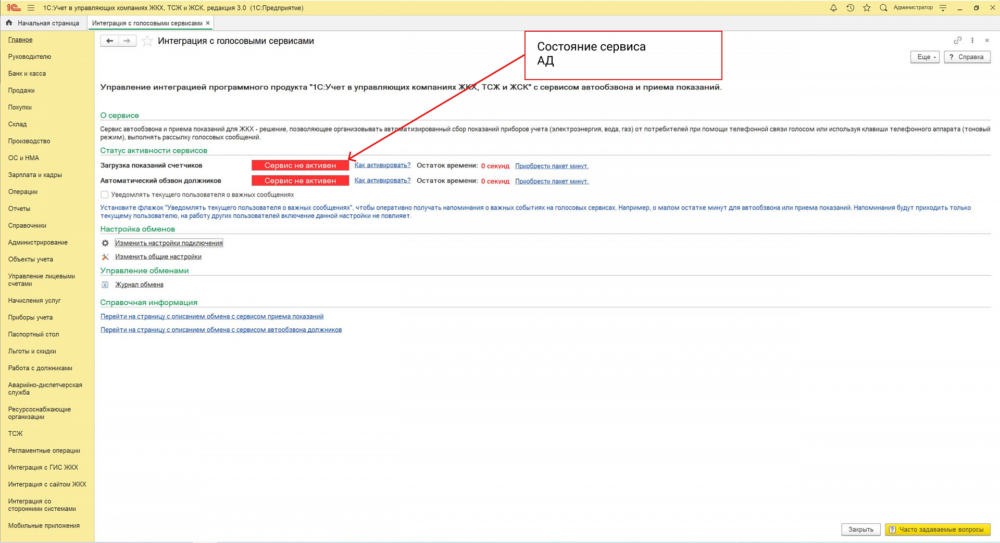
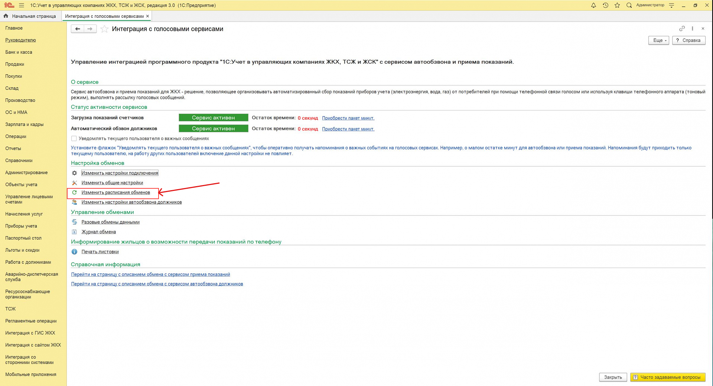
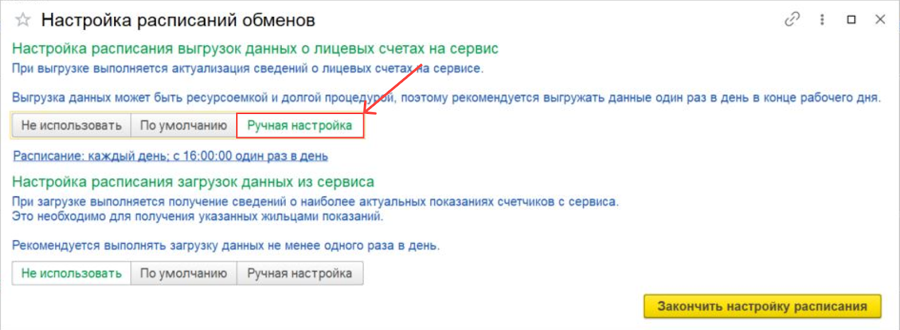
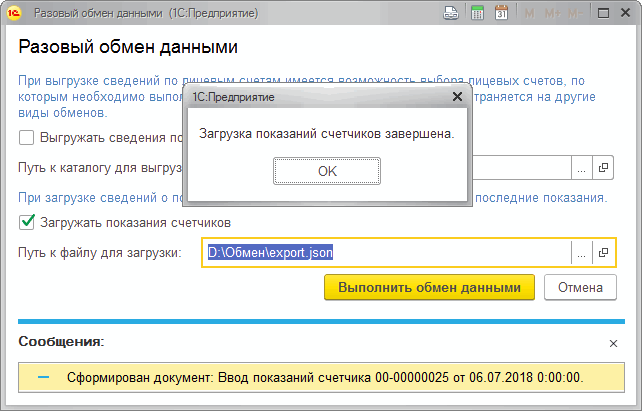

Загрузить свою базу данных вы можете 3 способами:

1. В автоматическом режиме через модуль **1С ЖКХ Рарус**
2. В ручном режиме через модуль **1С ЖКХ Рарус**
3. В ручном режиме через **Личный кабинет**

## Автоматический режим через 1С ЖКХ Рарус

В программе сервисы доступны из меню **Интеграция со сторонними системами** - **Интеграция с голосовыми сервисами**.


Окно **Интеграция с голосовыми сервисами** содержит следующие разделы:


В разделе **О сервисе** отображается информация об активности сервисов.


Раздел **Статус активности сервисов** - предназначен для отображения информации об активности сервисов. Каждый сервис может иметь один из следующих статусов:
**Сервис активен** - означает, что сервис активен и доступен для работы с ним.
**Сервис неактивен** - означает, что сервис не активен и не доступен для работы с ним.



🛈 По ссылке **Как активировать?** вы можете посмотреть подробное описание сервиса и его стоимости и оправить запрос на активацию сервиса.

**Сервис не оплачен** - означает, что сервис не оплачен и для его активации необходимо произвести оплату.
При низком балансе сервиса(ов), его можно пополнить с помощью кнопки **Приобрести пакет минут**.


Раздел **Настройки обменов** - предназначен для изменения настроек обмена данными с сервисами и содержит следующие пункты:
**Изменить настройки подключения** - позволяет изменить параметры подключения, предоставленные при приобретении сервиса: логин, пароль и сайт.


**Изменить общие настройки**- позволяет изменить настройки поле идентификации и услуг по сервисами автообзвона должников и автоматического приема показаний.




**Изменить расписания обменов** - позволяет изменить расписания обменов с сервисами автообзвона должников и автоматического приема показаний. Данная страница содержит следующие разделы:
Настройка **Расписания выгрузок данных о лицевых счетах на сервис** - предназначен для настройки расписания выгрузок данных о лицевых счетах на сервис.


Доступны следующие варианты настройки:


**Не использовать** - при данной настройке выгрузка по расписанию производиться не будет.


**По умолчанию** - при данной настройке выгрузка будет производиться с 16.00 один раз в день



**Ручная настройка** - при данной настройке расписание выгрузки можно настроить вручную.

🛈 Вы можете настроить расписание выгрузки по дням, неделям, месяцам или указать конкретную дату выгрузки, указав количество дней для повторения.

Настройка **Расписания загрузок данных из сервиса** - предназначен для настройки расписания загрузок данных о наиболее актуальных показаниях счетчиков с сервиса.


Доступны следующие варианты настройки:


**Не использовать** - при данной настройке загрузка по расписанию производиться не будет.


**По умолчанию** - при данной настройке загрузка будет производиться с 15.00 один раз в день.


**Ручная настройка** - при данной настройке расписание загрузки можно настроить вручную.

🛈 Вы можете настроить расписание загрузки по дням, неделям, месяцам или указать конкретную дату загрузки, указав количество дней для повторения.


**Изменить настройки автообзвона должников** - позволяет изменить настройки критериев, по которым будет выполняться отбор. Доступны следующие критерии:
**Сумма задолженности** - сумма задолженности, при достижении которой будет производиться автообзвон должника.
**Количество месяцев задолженности** - минимальное количество месяцев задолженности, при достижении которого будет производиться автообзвон должника.

🛈 Наличие тех или иных разделов настроек определяется оплаченным видом подписки на сервисы.


Раздел **Управление обменами** предназначен для мониторинга истории выполнения обменов и обмена данными с сервисами автообзвона должников и автоматического приема показаний вручную.
Содержит следующие пункты:


**Разовые обмены данными** - предназначен для разовой выгрузки или загрузки данных.

🛈 При этом в рамках выгрузки данных на сервис возможен выбор лицевых счетов, по которым необходимо выполнить выгрузку данных.


")

")


**Журнал обмена** - предназначен для просмотра информации об истории обменов.
Здесь указывается информация о виде обмена, дате обмена, статусе выполнения обмена, варианте запуска обмена (по расписанию или вручную), комментарий о результате выполнения обмена, а также имеется возможность открытия файла обмена.


Раздел **Информирование жильцов о возможности передачи показаний по телефону** предназначен для информирования жильцов о возможности передачи показаний счетчиков по телефону.


Раздел **Справочная информация** содержит гиперссылки на страницы с подробным описанием сервиса приема показаний и сервиса автообзвона должников.

## Ручной режим через 1С ЖКХ Рарус (Без интернета)

В программном продукте **1С: Учет в управляющих компаниях ЖКХ, ТСЖ и ЖСК** реализована возможность работы с голосовыми сервисами ЖКХ: Автообзвон должников и ЖКХ:  **Автоматический прием показаний счетчиков без использования сети Интернет**.
При настройке подключения голосовых сервисов в программе, необходимо выбрать режим работы:  **Работа без использования сети Интернет**:


Для выгрузки данных по лицевым счетам из программы необходимо открыть **Разовые обмены данными**, указать путь к папке, в которую будут выгружены файлы и нажать **Выполнить обмен данными:**


В указанной папке сохранится файл в формате **.zip:**


Данный архив необходимо загрузить на сайте https://api.kloud.one/, авторизовавшись в вашем личном кабинете:

.png "Кнопка Импорт (*.zip)")

.png "Кнопка Экспорт (.json)")

На компьютере сохранится файл «export.json, который необходимо загрузить в **1С: Учет в управляющих компаниях ЖКХ, ТСЖ и ЖСК**, указав путь к этому файлу:


При этом сформируется документ ввода показаний счетчика:



## Ручной режим через Личный кабинет

В ручном режим загрузка свой базы данных возможно 2 способами:
1. С помощью файла в формате **<название>.xlsx**.

Сервис Kloud.One ЖКХ: Автообзвон должников можно использовать и без программы 1С: Учет в управляющих компаниях ЖКХ, ТСЖ и ЖСК.
Вы можете загрузить данные по лицевым счетам и их задолженности непосредственно в личный кабинет на сайте https://api.kloud.one/.
Для этого необходимо создать файл в Excel в формате ***.xlsx**.

Как должен выглядеть этот файл:

| number  | city | street | house | apartment | sum | phone |
| ------- | ---- | ------ | ----- | --------- | --- | ----- |
|         |      |        |       |           |     |       |

где:
- city – город;
- street – улица;
- house – номер дома;
- apartment – номер квартиры;
- sum – сумма задолженности (с двумя знаками после запятой. Пример: 1000,52);
- phone – номер телефона (одиннадцать цифр, начиная с «8»).

После заполнения, файл необходимо загрузить на сайте https://api.kloud.one/.
Для этого необходимо авторизоваться в личном кабинете. Перейти в раздел «Управление лицевыми счетами», нажать на кнопку Импорт(.xlsx) и выбрать сохраненный файл:

.png "Кнопка Импорт (*.xlsx)")

2. С помощью Json-файла в формате .txt  **<название>.txt**, запакованный в ***zip-архив**.
В личном кабинете перейдите на вкладку Лицевые счета. Нажмите на кнопку **Импорт(*zip)**.
Структура Json-файла в .txt формате (Для АППС):

```
{
    "accs":
            [
                {
                    "id": [идентификатор л / с],
                    "number": [номер л / с],
                    "phone": [номер телефона],
                    "owner": [идентификатор владельца],
                    "address": [массив адрес]
                        {
                            "city": [город],
                            "street": [улица],
                            "house": [дом],
                            "house_type": [тип дома],
                            "apartment": [номер помещения],
                            "apartment_type": [тип помещения]
                        },
                    "debt": [массив задолженность]
                        {
                            "sum_of_debt": [сумма задолженности],
                            "months_of_debt_count": [количество месяцев задолженности],
                            "last_payment_date": [дата последней оплаты]
                        },
                    "meters": [массив счетчик]
                        [
                            {
                                "id": [код счетчика],
                                "name": [наименование счетчика],
                                "values": [количество тарифов 1 - 3],
                                "capacity": [количество разрядов],
                                "service": [наименование услуги],
                                "date": [дата последнего показания],
                                "val1": [дневное показание],
                                "val2": [ночное показание],
                                "val3": [пиковое показание]
                            },
                            {
                                …
                            },
                            [следующий счётчик]
                            {
                                ...
                            }
                                [последний  счётчик]
                        ]
                }
            ],
}
```
Структура Json-файла в .txt формате (Для АД):
```
{
    "accs":
    [
        {
            "id": [идентификатор л / с],
            "number": [номер л / с],
            "phone": [номер телефона],
            "owner": [идентификатор владельца],
            "address":
            {
                "city": [город],
                "street": [улица],
                "house": [дом],
                "house_type": [тип дома],
                "apartment": [номер помещения]
                "apartment_type": [тип помещения]
            },
            "debt":
            {
                "sum_of_debt": [сумма задолженности],
                "months_of_debt_count": [количество месяцев задолженности],
                "last_payment_date": [дата последней оплаты]
            },
            "meters": ""
        }
    ]
}
```
