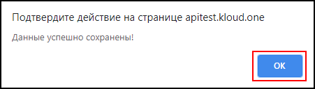

Перед запуском АД проверьте наличие лицевых счетов с номерами телефонов в поле Телефон начиная с 8 в формате 89000000000 ( Без знаков + , () . - ).  
Если лицевых счетов нет загрузите свою базу данных, как это сделать *ссылка*.

1. Для того чтобы включить модуль **АД** зайдите в личный кабинет и нажмите на вкладку.  

1. Из выпадающего списка выберите **Автообзвон должников**.  

1. Откроется модальное окно **Настройки автообзвона**, далее нажмите на кнопку **Активировать** в нижнем правом углу модального окна.  

1. После активации **АД** откроется модальное окно об успешной активации системы автообзвона и количеством участников автообзвона.
1. Нажмите на кнопку **ОК**  для подтверждения активации **АД**.

🛈 Если в таблице поле phone пустое, этот лицевой счет не будет включен в очередь на автообзвон.  
🛈 Если в таблице поле phone пустое у всех лицевых счетов, АД не активируется и появится модальное окно с ошибкой

")

