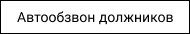

1. Для того чтобы изменить настройки АД зайдите в личный кабинет и нажмите на вкладку **Настройки**.  

1. Из выпадающего списка выберите Автообзвон должников.  

1. Откроется модальное окно **Настройки Автообзвона**. Нажмите на нужное поле вам поле и введите новые значения.
Например:  **Время начала** c 16:36 на 21:55.

