## Таблица Журнал звонков содержит:

Вкладка **Журнал Звонков** представляет собой таблицу **Журнала Звонков**, в которой отображаются данные о звонках: **Дата**, **Сценарий**, **Тип**, **Телефон**, **Данные**, **Статус**, **Длительность**, **Файл**, **Результат**, **Общая длительность** звонков, кнопки **Экспорт**, **Экспорт кеша**, **Удалить номер из кэша**, **Панель навигации** по таблице и поле **Данные за период**.

### Дата

В поле указывается дата и время звонка в формате **ДД.ММ.ГГГГ**, **ЧЧ.ММ.СС**. При нажатии на надпись **Дата** включается сортировка.

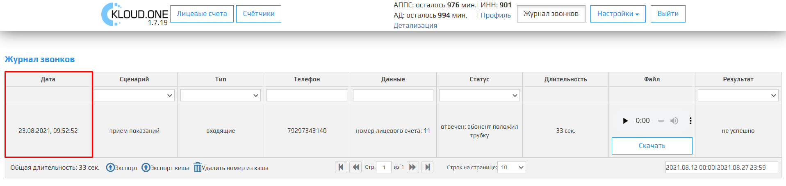

### Сценарий

В поле указывается модуль по сценарию которого был произведен звонок. При нажатии на надпись **Сценарий** включается сортировка. Имеется дополнительный выпадающий список со всеми модулями которые имеются у клиента, для поиска или сортировки.  
**Все** - показать звонки со всеми сценариями;  
**Прием показаний** - отображать звонки со сценарием "Приема показаний";  
**Автообзвон должников** - отображать звонки со сценарием "Автообзвона должников".

🛈 При выборе одного из пунктов в выпадающем списке и при нажатии на **Экспорт**, скачанный файл будет содержать данные только тех звонков, которые были отфильтрованы выбранным пунктом.   

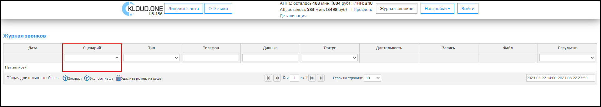

### Тип

В поле указывается тип звонка. 
При нажатии на надпись **Тип** включается сортировка. Имеется дополнительный выпадающий список со всеми типами звонков для поиска и сортировки.  
**Все** - показать все типы звонков;  
**Исходящие** - отображать только звонки исходящие от сервиса (автообзвон должников).  
**Входящие** - отображать только звонки входящие на сервис (прием показаний).

🛈 При выборе одного из пунктов в выпадающем списке и при нажатии на **Экспорт**, скачанный файл будет содержать данные только тех звонков, которые были отфильтрованы выбранным пунктом.    

### Телефон

В поле указывается номер телефона с которого звонили.  
Для сценария **Приема показаний** номер в формате **7xxxxxxxxxx**, а для **Автообзвона должников** в формате **8xxxxxxxxxx**.

🛈 При нажатии на надпись **Телефон** включается сортировка. Имеется дополнительное поле для поиска конкретного номера телефона.

### Данные

В поле **Данные** указывается данные, которые мы получаем из звонка.

Для звонков **Приема показаний**:

номер лицевого счета: <л/с>;  
счетчик n: <показание>;  
счетчик n+1: <показание>; (если 2-ух и более тарифный счетчик)  
счетчик n+2: <показание>. (если 3-ый тарифный счетчик)  

Для звонков **Автообзвона должников**:

номер лицевого счета: <лицевой счет>

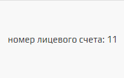

🛈 При нажатии надпись **Данные** включается сортировка. Имеется дополнительное поле для поиска конкретного номера лицевого счета/показания счетчика.

### Статус

В поле указывается один из статусов звонков (Все,отвечен,отменен,ошибка, запуск) и дополнительная информация().

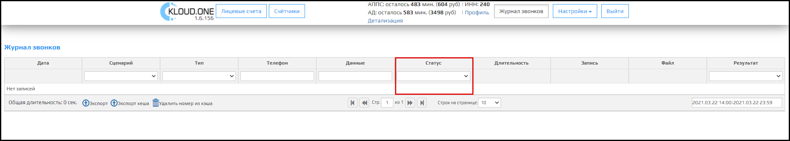

Выбрав **Все** отобразятся все статусы звонков.

Выбрав **Отвечен** отображается статус "Отвечен"и дополнительная информация присваивается в следующих ситуациях:  
1. "Отвечен: сервис завершил вызов" - когда звонок был принят и сценарий звонка был пройден до конца.  
2. "Отвечен: абонент положил трубку" - когда звонк был принят, но клиент положил трубку раньше, чем закончился сценарий звонка.

Выбрав **Отменен** отображается статус "Отменен" и дополнительная информация присваивается в следующих ситуациях:  
1. "Отменен: абонент не взял трубку"- когда звонок состоялся,  но абонент сбросил звонок.  
2. "Отменен: нулевой баланс сервиса"- когда по запущенному сервису нулевой баланс и требуется оплата.

Выбрав **Ошибка** отображается статус "Ошибка" и дополнительная информация присваивается в следующих ситуациях:
1. "Ошибка: временно не доступен" - когда абонент, недоступен, введенный номер не существует или записан в неправильном формате.   
2. "Ошибка: абонент занят" - абонент уже разговаривает с кем-то.  
3. "Ошибка: не смогли дозвониться до абонента" - абонент не поднял трубку от нашего сервиса.

🛈 При выборе одного из пунктов в выпадающем списке и при нажатии на **Экспорт**, скачанный файл будет содержать данные только тех звонков, которые были отфильтрованы выбранным пунктом.   

### Длительность

В поле указывается длина звонка в секундах.

🛈 Данные могут отличаться +-1 сек.

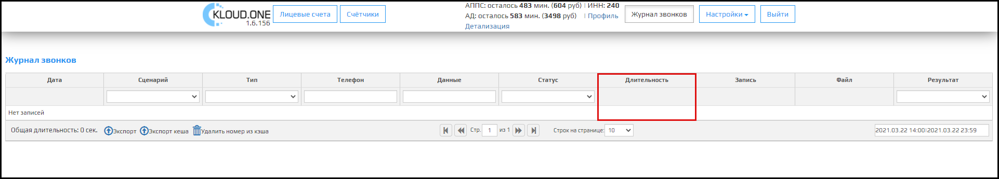

### Файл

В этом поле находится проигрыватель записи звонка. В его функции входит:
- Включение/выключение проигрывание записи.
- Перемотка по временной шкале.
- Увеличение/Уменьшение громкости.
- Заглушить запись.
- Скачать запись в формате *wav.

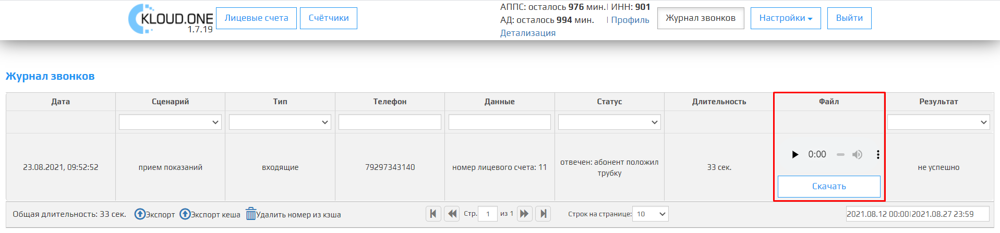

Ниже проигрывателя расположена кнопка **Скачать** , при нажатии на эту кнопку скачается запись звонка в формате *wav.

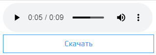

### Результат

В этом поле отображается резултат выполнения сервисов АД и АППС.

Для АППС:
1. Успешно - когда абонент подал показания минимум по одному счетчику.
2. Неупешно - когда:  
* Звонок не состоялся.
* Абонент не поднял трубку.
* Абонент поднял трубку, но ничего не произносит.
* Лицевой счет, который произносит абонент, удален или не существует.
* Счетчик, на который подают показания, удален или не существует.
* Абонент подает показания меньше текущих более 2 раз.
* Абонент игнорирует просьбу ввода показаний.

Для АД:
1. Успешно - когда робот полностью проговорил информацию о задолженности для абонента и завершил звонок.
2. Неупешно - когда:
* Звонок не состолся.
* Абонент не поднял трубку.
* Абонент поднял трубку, но сбросил звонок, до момента, когда робот закончит проговаривать информацию о задолженности.

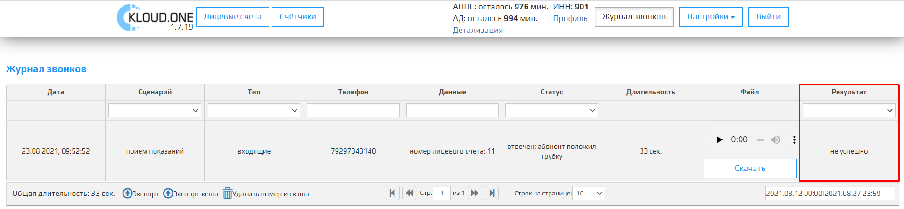

### Общая длительность

Отображает общую длительность звонков отображенных в таблице "Жернал звонков" в секундах

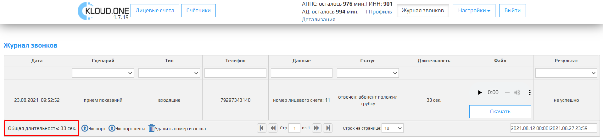

### Экспорт

После нажатия на кнопку **Экспорт** данные из таблицы экспортируются в файл **ключ модуля.csv**, в котором будут все данные из таблицы.

🛈 При выборе одного из пунктов в выпадающем списке у полей таблицы и при нажатии на **Экспорт**, скачанный файл будет содержать данные только тех звонков, которые были отфильтрованы выбранным пунктом. 

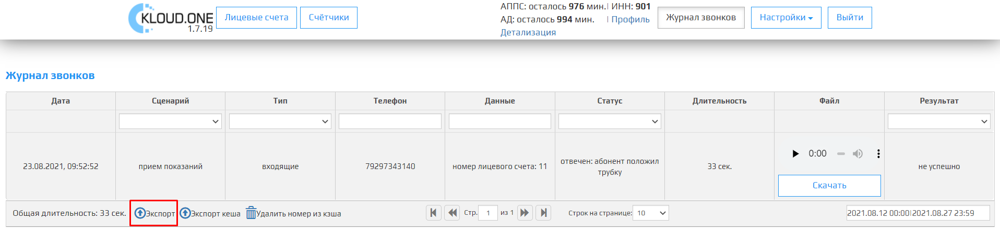

Формат экспортируемый таблицы:

| Дата, время            | Телефон     | Сценарий             | Статус    | Данные           | Длительность  | 
| ---------------------- | ----------- | -------------------- | --------- | ------           | ------------- |
| 23.08.2021, 09:52:52   | 79297343140 | автообзвон должников | входящие |     номер лицевого счета: 11    | 33 сек        |

### Экспорт кеша

После нажатия на кнопку **Экспорт кеша**  данные экспортируются в файл **ключ модуля.csv**, в котором будут все данные о **привязанных лицевых счетов к номеру телефона**.

| **Номер телефона** | **Лицевой счет** |
| ------------------ | ---------------- |
| 79297343140        | 11       |
| 79297343140        | 12       |

### Удалить номер из кэша

После нажатия на кнопку **Удалить номер из кэша** откроется модальное окно **Удалить номер из кэша** с полем для ввода **Номер телефона**. После ввода номера телефона и нажатии на кнопку **Удалить** , данный номер телефона удалится из базы привязанных лицевых счетов.

🛈 Привязанный номер 89990000000 и 79990000000 записываются как два отдельных номера.  
🛈 Для **Автообзвона должников** и **Приема показаний** один и тот же номер привязывается по разному. Для **Автообзвона должников** начаинается на **8**, для **Приема показаний** начинается на **7**.

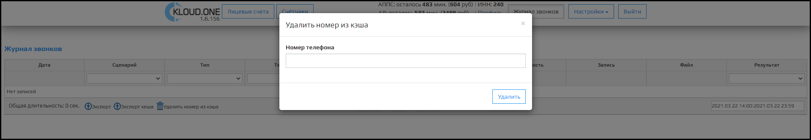

## Панель Управления по таблице содержит:

### Вернуться на первую страницу

После нажатия на кнопку **Вернуться на первую страницу** откроется 1 страница таблицы.

🛈 Тусклая кнопка означает что вы уже на первой странице или таблица всего имеет 1 страницу.

### Вернуться на предыдущую страницу

После нажатия на кнопку **Вернуться на предыдущую страницу** откроется предыдущая страница по счету таблицы.

🛈 Тусклая кнопка означает, что вы уже на первой странице или таблица всего имеет 1 страницу.

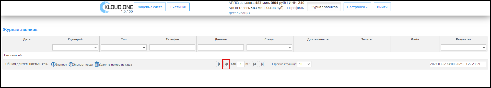

### Стр.

Поле **Стр.** отображает количество страниц таблицы, этот параметр связан с **параметром Строк на странице**, чем больше строк на странице, тем меньше страниц в таблице.

### Перейти на следующую страницу

После нажатия на кнопку **Перейти на следующую страницу** откроется следующая страница по счету таблицы.

🛈 Тусклая кнопка означает, что открыта последняя страница или таблица всего имеет 1 страницу.

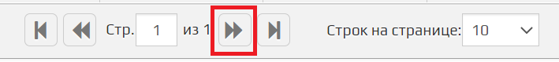

### Перейти на последнюю страницу

После нажатия на кнопку **Перейти на последнюю страницу** откроется последняя страница таблицы.

🛈 Тусклая кнопка означает что вы уже на последней странице или таблица всего имеет 1 страницу.

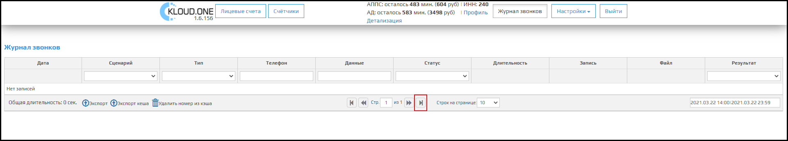

### Строк на странице

Поле **Строк на странице** отображает количество строк в таблице. Из выпадающего списка имеется возможность выбрать одно из несколько значений: 10, 20, 50, 100, 200, 500, 5000, 20000, 100000, 500000.

 🛈 Это поле связано с полем **Стр**, чем больше строк на странице, тем меньше страниц в таблице.

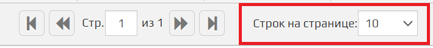

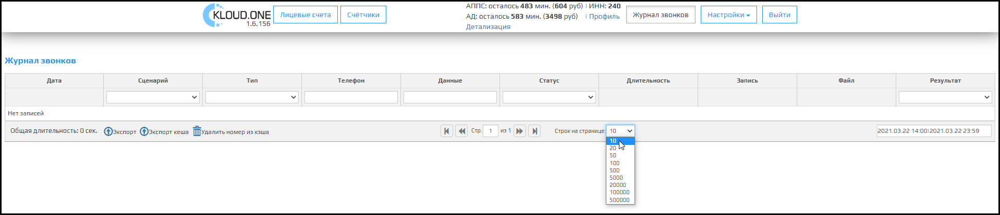