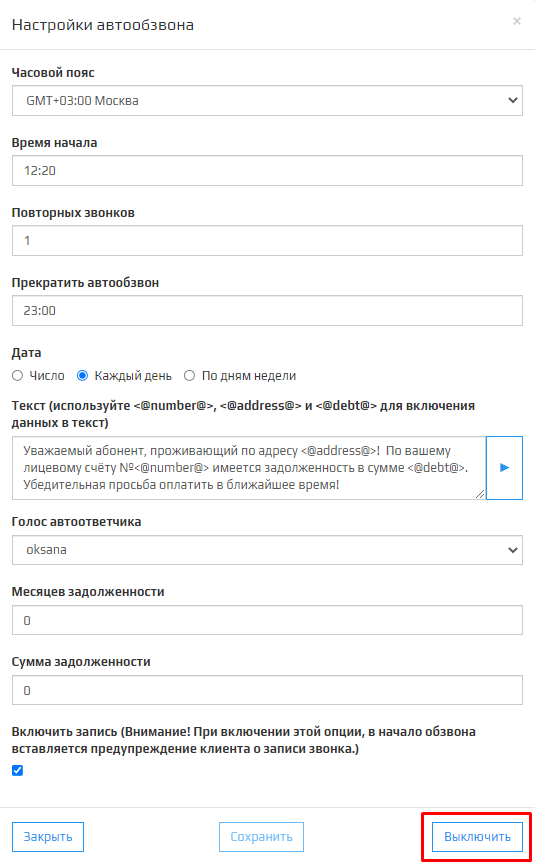

1. Для того чтобы выключить модуль **АД** зайдите в личный кабинет и нажмите на вкладку.  

1. Из выпадающего списка выберите.   

1. Откроется модальное окно **Настройки Автообзвона**. В нижнем правом углу нажмите на кнопку.  

1. После активации **АД** откроется модальное окно об деактивации системы автообзвона. Нажмите на кнопку для подтверждения деактивации АД.  

