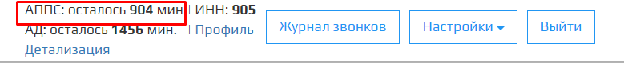

Проблема распознования ввода данных с клавиш телефона при **Приеме показаний** решается соблюдейнием следующих проверок:  
1. Проверьте способ ввода данных в настройках **Приема показаний**.  
🛈 Робот принимает показания с клавиш телефона, если вы выбрали способ ввода данных **DTMF**.

2. Проверьте в Личном кабинете баланс модуля **Автоматический прием показаний счетчиков**.

3. Проверьте баланс Sip-подключения номера телефона.  
Если после прохождения вышеперечисленных проверок, робот так и не распознал ваш ввод данных с клавиш телефона при **Приеме показаний**, нажмите на кнопку  в правом нижнем углу и напишите обращение в техподдержку.

