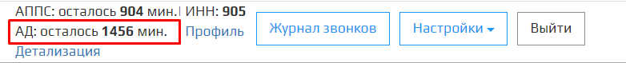

Проблема с запуском **Автообзвона должников** решается соблюдейнием следующих проверок:  

1. Проверьте в Личном кабинете запущен ли модуль **Автообзвон должников**.

2. Проверьте в Личном кабинете баланс модуля **Автообзвон должников**.

3. Проверьте в правильность выбранных вами параметров - **Часововй пояс**, **Время начала**, **Прекратить автообзвон**, **Дата**, **Месяцев задолженности** и **Сумма задолженности**.

4. Проверте правильность введенных данных в настройках SIP аккаунта.

5. Проверьте баланс Sip-подключения номера телефона.  

Если после прохождения вышеперечисленных проверок, вам не удалось запустить **Автообзвон должников**, нажмите на кнопку  в правом нижнем углу и напишите обращение в техподдержку.

