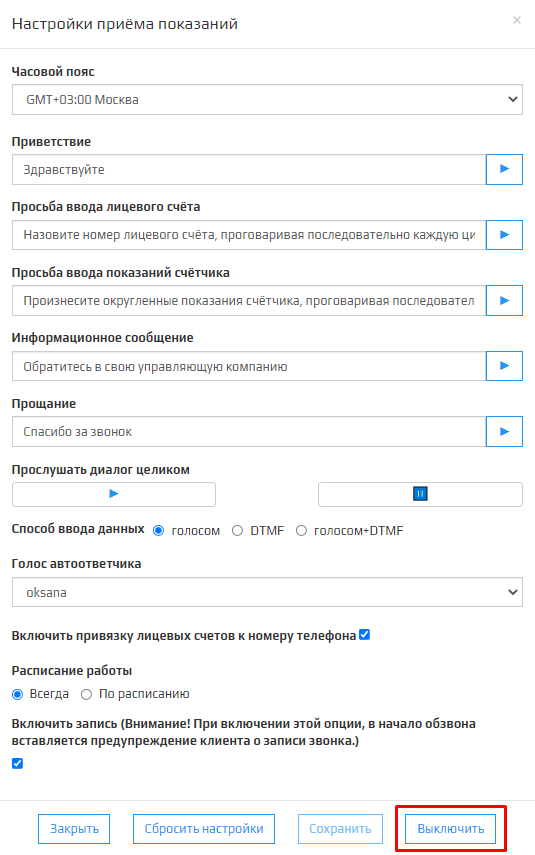

Проблема с запуском **Приема показаний** решается соблюдейнием следующих проверок:

1. Проверьте в Личном кабинете запущен ли модуль **Автоматический прием показаний счетчиков**.

2. Проверьте в Личном кабинете баланс модуля **Автоматический прием показаний счетчиков**.

3. Проверьте в правильность параметра **Часовой пояс**, **Расписание работы**.

4. Проверте правильность введенных данных в настройках SIP аккаунта.

5. Проверьте баланс Sip-подключения номера телефона.

Если после прохождения вышеперечисленных проверок, вам не удалось запустить **Прием показаний**, нажмите на кнопку  в правом нижнем углу и напишите обращение в техподдержку.

