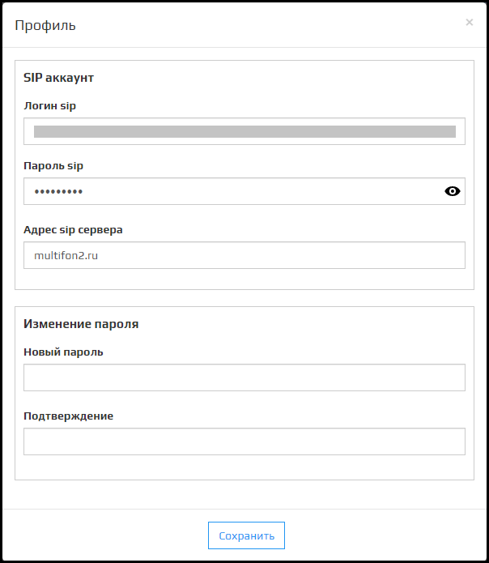
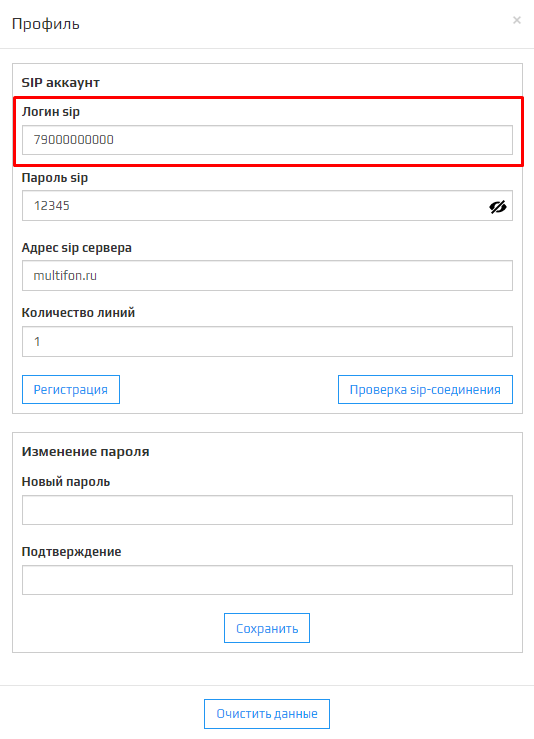

1. Авторизуйтесь в **Личный кабинет** Kloud.one, нажмите на вкладку **Профиль**.

2. Откроется модальное окно с настройками.

3. Выберите поле **Логин sip** и запишите новый номер телефона начиная с 7 (Телефон записывается без символов + . , ( ) - _ ).

4. Выберите поле **Пароль sip** и запишите новый пароль.

5. После всех изменений нажмите кнопку **Регистрация**.

6. После чего появится модальное окно с оповещением о том, что профиль был успешно обновлен. Для продолжения нажмите кнопку **Ок**.

Если после прохождения вышеперечисленных этапов, вам не удалось изменить **Логин** и **Пароль** вашего SIP аккаунта, нажмите на кнопку  в правом нижнем углу и напишите обращение в техподдержку.

